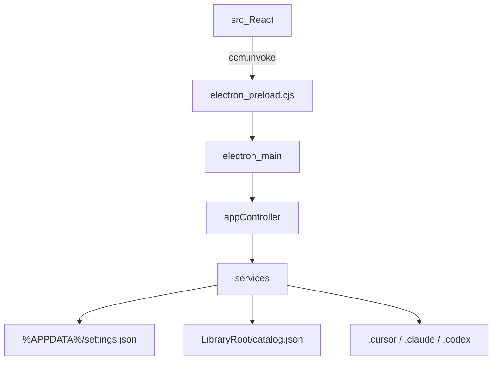

---
page:
  preset: A2
  elongation: 1
  orientation: landscape
  columns: 4
  gutter_mm: 8
  margin_mm:
    - 25
    - 20
    - 25
    - 20
  width_mm: 594
  height_mm: 420
---

# 项目架构

## 项目目标

本机「永久库」与 Cursor / Claude / Codex **容器路径**之间的 skills、rules、agents、commands、hooks 台账与路径管理：文件在永久库时不生效，放入容器后才被调用。

服务对象：个人开发者，统一管理多项目 / 用户级配置资产；并缓解同名多版本散落、分不清定稿的问题。

产品逻辑（痛点、库↔容器、默认目录边界）见 [08-程序核心逻辑](08-程序核心逻辑.md)。**当前实现**：部署为 Copy（库常驻正本）；移出/迁入按内容哈希同删异选。

## 工作面隔离（硬约束）

本仓库代码与永久库内容是**两套工作面**，必须绝对隔离：

* **写 skills / rules**：只写给 AI 的领域与行为约束，**不需要、也不应该**迁就本仓库的实现细节。

* **写本软件代码**：只处理路径、目录、台账与 Deploy/Withdraw；**不需要、也不应该**理解或依赖正文语义。

完整条款与反例见 [00-工作面隔离原则](00-工作面隔离原则.md)。架构上的直接推论：管理器是路径操作器，不是内容解释器。

## 技术栈

##

| 层级    | 技术                             | 说明                               |
| ----- | ------------------------------ | -------------------------------- |
| 桌面壳   | Electron 42.5.0                | 对齐本机 hymd-code，复用 Electron Cache |
| 渲染 UI | React 19 + Vite 6 + TypeScript | AI 出活快；浅色 Fluent 观感              |
| 主进程业务 | Node fs + TypeScript services  | 自 WPF Services/ 移植；部署 Copy、迁入/移出按哈希对账 |
| 包管理   | npm                            | 与 hymd 习惯一致                      |
| 历史对照  | `Archive/legacy-wpf/`          | 原 .NET 8 WPF 半成品，已归档；不参与构建 |

## 模块划分

| 模块                                  | 职责                                                      |
| ----------------------------------- | ------------------------------------------------------- |
| `electron/main.ts`                  | 无边框窗口、IPC、窗口控制                                          |
| `electron/appController.ts`         | 快照、命令面、默认库、操作日志                                         |
| `electron/services/*`               | Catalog / Scan / Ingest / Settings / Discovery / Config |
| `src/App.tsx`                       | 导航、列表、详情、右键（先选中）、侧栏显隐与命令面                              |
| `src/layout/WorkbenchSplit.tsx`     | 主区三栏：VS Code SplitView 语义（优先级伸缩 + sash）                 |
| `shared/ipc.ts` / `shared/types.ts` | IPC 契约与领域类型                                             |

## 数据流 / 交互

1. 启动 → `ensureDefaultLibrary`（未配置则 `C:\CursorSkills`）→ `getSnapshot`
2. 可选弹出扫描迁入预览 → 用户确认后登记 / Ingest 入库
3. Deploy / Withdraw：永久库 ↔ 活动容器（用户级 `.cursor` / `.claude` / `.codex` 或项目 `.cursor`）
4. UI 状态（导航、栏宽、左右栏可见性、筛选）写入 `settings.json`；catalog 为 camelCase 台账
5. 同内容可按哈希对账；异内容走冲突决议；扫描/部署/移出写状态点，恢复只回路径

## 关键架构决策

| 决策   | 选择                                 | 理由                    | 日期         |
| ---- | ---------------------------------- | --------------------- | ---------- |
| 壳技术  | Electron（非 WebView2/WPF）           | 统一默认栈；用户指定整仓重构        | 2026-07-21 |
| 前端   | React + Vite + TS                  | 语料多、改 UI 快            | 2026-07-21 |
| 交互   | 右键为主、顶栏精简                          | 降低按钮噪音                | 2026-07-21 |
| 外观   | 浅色 + 无边框标题栏                        | 贴近原 Light / Cursor 习惯 | 2026-07-21 |
| 数据兼容 | 沿用 AppData settings + catalog.json | 不打断现网永久库              | 2026-07-21 |
| 部署语义 | Copy + 双份态（库正本常驻）                  | 避免「使用中库为空」；定稿在库     | 2026-07-25 |
| 主区布局 | WorkbenchSplit（列表 High、侧栏 Low）    | 缩窗优先保列表；可显隐左右栏      | 2026-07-26 |

## 目录映射（可选）

| 路径                            | 模块                    |
| ----------------------------- | --------------------- |
| `electron/`                   | 主进程                   |
| `src/`                        | 渲染进程                  |
| `src/layout/`                 | WorkbenchSplit / SplitViewModel |
| `shared/`                     | 共享类型                  |
| `Archive/legacy-wpf/`         | 旧 WPF 实现对照（已归档） |
| `Docs/`                       | 本固定结构文档               |
| `scripts/ensure-electron.mjs` | Node 20 下 path.txt 修复 |

***

**版本**：v1.4 | **更新**：2026-07-26
