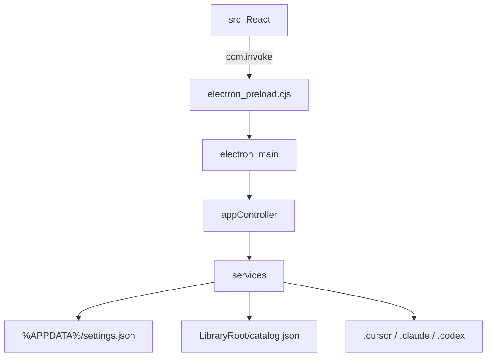

# 项目架构

> 面向 AI 阅读：路径精确到文件、命名与代码一致，供检索与改码定位。  
> 产品逻辑与用户视角见 [01-核心逻辑](01-核心逻辑.md)。  
> **本仓现状（已验证）**：姊妹仓 `CursorConfigManagerTauri2` 代码仍为 Electron；Tauri 2 换壳见 [Plan/05](Plan/05-Tauri2完整对比与姊妹仓重构-2026-07-29.md)，**尚未开工**。

## 项目目标

本机「永久库」与 Cursor / Claude / Codex **容器路径**之间的 skills、rules、agents、commands、hooks 台账与路径管理：文件在永久库时不生效，放入容器后才被调用。

服务对象：个人开发者，统一管理多项目 / 用户级配置资产；并缓解同名多版本散落、分不清定稿的问题。

**当前实现**：部署为 Copy（库常驻正本）；移出/迁入按内容哈希同删异选。

## 工作面隔离（硬约束）

本仓库代码与永久库内容是**两套工作面**，必须绝对隔离：

| 工作面 | 职责 | 禁止 |
|--------|------|------|
| A. skills / rules 正文 | 领域约束与 AI 行为说明 | 迁就本仓库 IPC / 服务实现 |
| B. 本软件代码 | 路径、目录、台账、Deploy/Withdraw | 解析或依赖正文语义 |

架构推论：管理器是路径操作器，不是内容解释器。全文见 [Archive/00-工作面隔离原则-归档-2026-07-29](Archive/00-工作面隔离原则-归档-2026-07-29.md)。

## 技术栈

| 层级 | 技术 | 版本 | 说明 |
|------|------|------|------|
| 桌面壳 | Electron | 42.5.0 | 对齐本机 hymd-code，复用 Electron Cache；姊妹仓目标壳为 Tauri 2（未落地） |
| 渲染 UI | React + Vite + TypeScript | React 19 / Vite 6 | AI 出活快；浅色 Fluent 观感 |
| 主进程业务 | Node fs + TypeScript services | — | 自 WPF Services/ 移植；部署 Copy、迁入/移出按哈希对账 |
| 包管理 | npm | — | 与 hymd 习惯一致 |
| 历史对照 | `Archive/legacy-wpf/` | — | 原 .NET 8 WPF 半成品，已归档；不参与构建 |

## 模块划分

| 模块 | 职责 | 入口文件（相对仓库根） |
|------|------|------------------------|
| 主进程窗口 | 无边框窗口、IPC、窗口控制 | `electron/main.ts` |
| 应用控制器 | 快照、命令面、默认库、操作日志 | `electron/appController.ts` |
| 领域服务 | Catalog / Scan / Ingest / Settings / Discovery / Config | `electron/services/*` |
| 主 UI | 导航、列表、详情、右键、侧栏显隐与命令面 | `src/App.tsx` |
| 主区布局 | 三栏：VS Code SplitView 语义（优先级伸缩 + sash） | `src/layout/WorkbenchSplit.tsx` |
| IPC 契约 | 命令名与领域类型 | `shared/ipc.ts` / `shared/types.ts` |

## 目录映射

| 目录 / 文件 | 归属模块 | 说明 |
|-------------|----------|------|
| `electron/` | 主进程 | 窗口、IPC、services |
| `electron/preload.cjs` | 预加载 | 静态 CJS，暴露 `window.ccm` |
| `src/` | 渲染进程 | React UI |
| `src/layout/` | 主区布局 | WorkbenchSplit / SplitViewModel |
| `src/components/DetailMarkdownCrepe.tsx` | 详情 Markdown | Milkdown Crepe 宿主 |
| `shared/` | 共享类型 | IPC 契约与领域类型 |
| `scripts/ensure-electron.mjs` | 工具链 | Node 20 下 path.txt 修复 |
| `Archive/legacy-wpf/` | 历史对照 | 旧 WPF 实现（已归档） |
| `Docs/` | 文档 | L0 固定结构（README + 01~06） |

## 数据流 / 交互

1. 启动 → `ensureDefaultLibrary`（未配置则 `C:\CursorSkills`）→ `getSnapshot`
2. 扫描仅工具栏「扫描建库」触发 → 用户确认后登记 / Ingest 入库（启动不自动扫描）
3. Deploy / Withdraw：永久库 ↔ 活动容器（用户级 `.cursor` / `.claude` / `.codex` 或项目 `.cursor`）
4. UI 状态（导航、栏宽、左右栏可见性、筛选）写入 `settings.json`；catalog 为 camelCase 台账
5. 同内容可按哈希对账；异内容走冲突决议

## 关键架构决策

| 决策 | 选择 | 理由 | 日期 |
|------|------|------|------|
| 壳技术 | Electron（非 WebView2/WPF） | 统一默认栈；用户指定整仓重构 | 2026-07-21 |
| 姊妹仓实证 | 另开 `CursorConfigManagerTauri2` 做 Tauri 2 闸门对比 | 生产 Electron 仓不动；见 Plan/05 | 2026-07-29 |
| 前端 | React + Vite + TS | 语料多、改 UI 快 | 2026-07-21 |
| 交互 | 右键为主、顶栏精简 | 降低按钮噪音 | 2026-07-21 |
| 外观 | 浅色 + 无边框标题栏 | 贴近原 Light / Cursor 习惯 | 2026-07-21 |
| 数据兼容 | 沿用 AppData settings + catalog.json | 不打断现网永久库 | 2026-07-21 |
| 部署语义 | Copy + 双份态（库正本常驻） | 避免「使用中库为空」；定稿在库 | 2026-07-25 |
| 主区布局 | WorkbenchSplit（列表 High、侧栏 Low） | 缩窗优先保列表；可显隐左右栏 | 2026-07-26 |

---

**版本**：v2.0 | **更新**：2026-07-29
