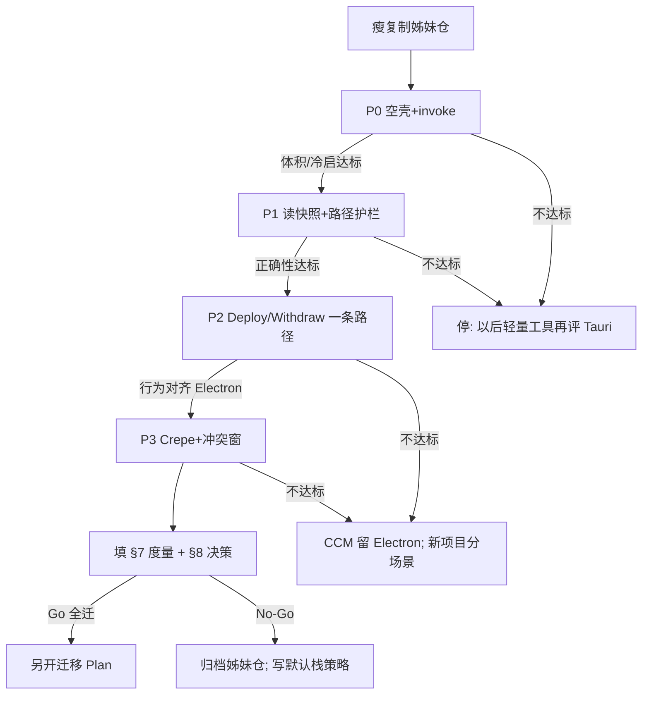

# 05 · Tauri 2 完整对比与姊妹仓重构计划

> **日期**：2026-07-29  
> **性质**：具体执行计划（前瞻）；**不是**已定「全面弃 Electron」  
> **关联**：[Research/019](../Research/019-Tauri2与本仓Electron对比-2026-07-29.md)；[Research/002](../Research/002-WebView2与Electron对比-2026-07-21.md)；[Research/018](../Research/018-市场格局与竞品产品调研-2026-07-29.md)  
> **你的设想**：完全复制 `E:\Code\CursorConfigManager` → `E:\Code\CursorConfigManagerTauri2`，在姊妹仓重构做完整对比。  
> **对设想的判定（建议）**：**方向合理（隔离实验），做法需改**——不要「整仓原样复制后一口气重写」；要 **瘦复制 + 分闸门 PoC + 双应用数据隔离 + 书面 Go/No-Go**。本计划同时回答「以后新软件默认选谁」。

---

## 1. 先给结论

| 问题 | 答案 | 级别 |
|------|------|------|
| 另开姊妹仓做对比，是否合理？ | **合理**。生产 Electron 仓不动，降低回归风险。 | 建议 |
| 「完全复制再全面重构」是否合理？ | **不合理作第一步**。复制应排除 `node_modules` / `release` / 大缓存；重构必须 **按闸门**，未过闸不得宣称「Tauri 可替代」。 | 建议 |
| 对比目的是 CCM 一仓还是以后行为？ | **两者都要**。CCM 是**金丝雀样本**；闸门结果写入「个人默认壳策略」。 | 建议 |
| 今日是否应弃 Electron？ | **否**。019 仍成立；本计划是**受控实证**，不是迁移开工令。 | 建议 |

---

## 2. 你的计划：哪里对、哪里要改

### 2.1 对的部分

- **物理隔离**：不在 `CursorConfigManager` 主线上直接拆 Electron，避免半成品毁自用工具。  
- **用真实产品当样本**：比空 Hello World 更接近「以后做同类桌面工具」的成本。  
- **目标是对比而非冲动换壳**：与「完整对比影响以后行为」一致。

### 2.2 必须改掉的部分

| 原设想 | 问题 | 改成 |
|--------|------|------|
| 「完全复制」含 `node_modules`、`release`、`.vite` 等 | 体积巨大、无意义、易混路径 | **瘦复制**或 `git clone` / `robocopy` 排除清单（§4） |
| 复制后立刻全量把 `services/*` 迁 Rust | 无早期失败信号；数周后才知 Crepe/体积/权限翻车 | **P0→P3 闸门**；任一门失败可停，不必 sunk cost |
| 两仓默认同一 `%APPDATA%\CursorConfigManager` + 同一永久库 | 双开会抢 `settings.json` / `catalog.json`，对比数据污染 | **改 app 名与 settings 目录**；对比期用**独立库根**（§5） |
| 以「能跑起来」当成功 | 对「以后默认栈」证据不足 | 成功 = **度量表填满 + 书面决策**（§7、§8） |
| 姊妹仓无限期与主仓双轨 | 维护税；Docs/规则漂移 | 设 **决策日**（建议对比窗 2–4 周）；之后保留归档或合并一条主线 |

### 2.3 一句话修正版计划

> 建立 **瘦身姊妹仓** `CursorConfigManagerTauri2` → 只保留前端与契约 → 用 Tauri 2 重做壳与**最小**后端 → **分闸门**扩到 Deploy/冲突/Crepe → **填完整度量与决策表** → 决定 CCM 是否迁、以及**以后新项目默认壳**。

---

## 3. 完整对比要回答的问题（范围）

本对比 **不是**「哪个框架星星多」，而是你以后行为的三层决策：

| 层 | 问题 | 产出 |
|----|------|------|
| **A. 样本层（CCM）** | 把现有 CCM 迁到 Tauri，性价比是否成立？ | Go / No-Go / 仅新功能用 Tauri |
| **B. 品类层** | 「本地文件型桌面工具 + Web UI」默认选谁？ | 个人默认策略（§8） |
| **C. 例外层** | 何种项目仍选 Electron / 纯 WebView2 / 原生？ | 例外清单 |

**必须覆盖的对比轴**（每轴有数或有结论，禁止只凭感觉）：

1. **交付体积**（installer / unpacked）  
2. **冷启动与空闲内存**（同机、同库规模）  
3. **主路径正确性**（Deploy / Withdraw / 冲突 / 扫描）  
4. **编辑器可用性**（Crepe 打开、保存、快捷键）  
5. **工程成本**（人日：到 P2 / 到功能对等）  
6. **安全模型**（capabilities vs 现有 sandbox+IPC 白名单）  
7. **工具链摩擦**（Rust 安装、CI、AI 改码速度、与 hymd 同栈收益）  
8. **跨平台**（若你声称要跨平台：至少 Win 实测；mac 可标「本期不做」）

与 019 的关系：019 = **纸面结论**；本 Plan = **实证协议**。实证可推翻 019。

---

## 4. 姊妹仓建立（替换「完全复制」）

### 4.1 推荐路径（三选一，优先级从上到下）

| 方式 | 做法 | 适用 |
|------|------|------|
| **A. git clone / 新 remote 本地复制** | 新目录 clone 同一 remote，新分支 `tauri2-spike`；或 `git clone --local` | 有 git、要历史时可查 |
| **B. robocopy 瘦复制** | 见下方排除表 | 无干净 clone 时 |
| **C. 仅脚手架** | `npm create tauri-app` + 手工拷 `src/`、`shared/` | 最干净，但丢脚本/Docs 对照成本 |

**不推荐**：资源管理器整夹复制（必带 `node_modules`/`release`）。

### 4.2 瘦复制排除清单（硬）

复制 **不要** 带：

- `node_modules/`
- `release/`、`dist/`、`dist-electron/`
- `.vite/`、覆盖率/缓存目录
- 本机密钥、`.env`（若有）

复制 **要** 带（最少）：

- `src/`、`shared/`、`electron/`（作 Rust 移植参照，不是继续跑 Electron）
- `package.json` / lock（随后大改）
- `Docs/`（可只链回主仓 Research/019、本 Plan，避免双份 Docs 漂移——**建议姊妹仓 Docs 只留 `Plan-spike.md` 指针**）

### 4.3 建立后立即改名（硬）

| 项 | Electron 主仓 | Tauri 姊妹仓（必须不同） |
|----|---------------|--------------------------|
| 文件夹 | `CursorConfigManager` | `CursorConfigManagerTauri2` |
| 产品名 / `productName` | CursorConfigManager | 例如 `CCM-Tauri2` |
| settings 目录 | `%APPDATA%\CursorConfigManager` | `%APPDATA%\CCM-Tauri2`（或等价） |
| 默认永久库 | 例如 `C:\CursorSkills` | 例如 `C:\CursorSkills-Tauri2Spike`（**对比期专用**） |
| 窗口标题 | 可辨认 | 带 `Tauri2` 后缀 |

未改名就双开 = **对比无效**（数据互相覆盖）。

### 4.4 环境前置（待你本机确认）

- [ ] Rust stable + `rustup`
- [ ] Tauri 2 CLI / 项目模板
- [ ] WebView2 Runtime（Win10/11 通常已有）
- [ ] Node LTS（前端仍用）
- [ ] 会建 VS 的 C++ 构建工具（Windows 编 Tauri 常用）

---

## 5. 分阶段闸门（执行 checklist）

每阶段结束：**填度量 → Go/Kill**。Kill 不丢人，目的就是省全量重写。

### P0 · 空壳可运行（目标：1–3 天量级，推断）

- [ ] 姊妹仓 `tauri dev` 起窗，加载**最小** React 页（可先非全量 App）
- [ ] 一条 `invoke('ping')` → Rust 回字符串
- [ ] `tauri build` 产出 Windows 包；记录 **安装包/解包目录 MB**
- [ ] 记录冷启体感（秒，同机；方法对齐 [015](../Research/015-冷启动测试三种形态差异-2026-07-28.md) 精神：用发行态而非纯 dev）

**Kill 条件**：工具链装不通、或 build 包体积相对 Electron **无明显优势**（例如仍 >150 MB unpacked 且无解释）且你本就为体积而来。

### P1 · 只读快照（目标：数天，推断）

- [ ] Rust 实现「读独立库根 → 返回与 `getSnapshot` **字段兼容**的 JSON」（可先子集）
- [ ] 路径护栏思想保留（不可读到库外任意盘）
- [ ] 前端列表能显示条目（可暂用简化 UI）

**Kill 条件**：JSON 契约对不齐导致前端大面积改写成本爆炸；或文件枚举性能相对 Electron 差一个数量级且无优化路径。

### P2 · 一条写路径（目标：约 1 周量级，推断）

- [ ] Deploy **或** Withdraw **一条**主路径与 Electron 行为对照（同库 fixture）
- [ ] 哈希同删 / 异内容进冲突（至少一种）在 Tauri 侧可演示
- [ ] capabilities：仅允许配置的库根与容器根

**Kill 条件**：正确性对不齐且修复成本 >「继续 Electron 做产品」；或 capabilities 与批量路径操作严重打架。

### P3 · 编辑器与完整壳（仅 P2 Go 后）

- [ ] 详情 Crepe（或当前编辑器）在 WebView2 下：打开、编辑、保存、最小 diff 写回
- [ ] 无边框/托盘/便携若需要，单独立项，**不阻塞**栈决策
- [ ] 与 Electron 主仓做 **同机 A/B**：体积、内存、冷启、主路径

**Kill 条件**：Crepe/快捷键/IME 在 WebView2 上不可接受缺陷且无替代编辑器方案。

### P4 · 决策与策略落盘（必做，即使 Kill）

- [ ] 填满 §7 表  
- [ ] 写 §8 个人默认栈策略（可进主仓 Research 新篇或本 Plan 附录更新）  
- [ ] 姊妹仓：归档说明 / 删除 / 或转正式迁移仓（三选一写明）

---

## 6. 工作方法（降低双轨成本）

| 规则 | 说明 |
|------|------|
| **主仓继续产品** | skills.sh、安全闸等仍可在 Electron 推进；不因 spike 停摆 |
| **契约单向参照** | `shared/ipc.ts` / types 以主仓为 SSOT；姊妹仓只适配，不反向改主仓契约除非两边同意 |
| **禁止过早删 Electron 代码** | 姊妹仓可删 `electron/` 运行路径，但保留作移植对照直至 P2 过 |
| **禁止 Node sidecar 当「假 Tauri」** | 对比期若用 sidecar，体积数字必须标注「含 Node」，不得当纯 Tauri 胜出 |
| **记录人日** | 每阶段实际小时；否则无法回答「以后行为」里的成本轴 |

---

## 7. 度量登记表（实证用，先空着填）

> 填表前级别均为 **待验证**。Electron 侧可先填已有数。

| 指标 | Electron 主仓 | Tauri 姊妹仓 | 备注 |
|------|---------------|--------------|------|
| unpacked / 安装包 MB | ~403 / portable~95（019 已测） | | 同机、同前端资产版本尽量对齐 |
| 空闲内存 MB | | | 任务管理器或等价；注明库内条目数 |
| 冷启到可点秒数 | | | 发行态；各测 ≥3 次取中位 |
| P0 人日 | 0（已有） | | |
| P2 人日 | — | | 到「一条 Deploy 正确」 |
| 功能对等人日估 | — | | P3 后估全量 |
| Crepe 关键用 | 已验证·本仓 | | 通过/失败+缺陷 |
| 双开数据隔离 | 同 APPDATA 会冲突 | | 改名后应通过 |
| 主观：AI 改后端效率 | TS 高 | Rust ? | 1–5 分自评 |

**判定阈值（建议·可改）**：

- 体积：Tauri unpacked **≤ 80 MB** 或相对 Electron **≤ 25%** → 体积轴 Go  
- 冷启：不慢于 Electron，或慢 <20% 但体积换来可接受  
- 正确性：P2 fixture **全绿** 才谈迁  
- 成本：估全量对等 **> 6 人周** 且产品功能未完成 → CCM **不迁**，策略走「新项目可选」

（阈值可在 P0 后按你的痛点改写；改写须记一笔，避免事后移动球门。）

---

## 8. 以后软件开发的默认策略（对比结束后填写）

先给 **对比前的草稿策略**（建议·可被实证推翻）：

| 项目类型 | 默认壳 | 理由 |
|----------|--------|------|
| 已有 Electron 产品（CCM、hymd 系） | **留 Electron** | 沉没成本 + 同栈协同，除非体积 P0 |
| 新项目：本地文件工具 + Web UI + 要小安装包 | **优先试 Tauri 2** | 019 纸面优势；以本 spike 成本校准 |
| 新项目：强依赖 Node 生态 / 快速 AI 出活 / 编辑器极重 | **Electron** | 后端零重写、Chromium 一致 |
| 仅 Windows + 愿写 C# 宿主 | WebView2 宿主（见 002） | 与 Tauri Win 同族渲染，无 Rust 门槛 |
| CLI/TUI 为主 | 非桌面壳 | 对标 asm 路线，不套 Tauri |

**对比结束后**：把上表改成「已验证策略」，并决定：

1. CCM：迁 / 不迁 / 长期双轨（一般禁止长期双轨）  
2. 新项目模板：是否做 `tauri2-template` 私有脚手架  
3. 学习投资：是否系统补 Rust（若默认 Tauri）

---

## 9. 风险与对策

| 风险 | 影响 | 对策 |
|------|------|------|
| 双开抢配置/库 | 对比数据作废、主库损坏 | §4.3 强制改名 + 独立库根 |
| 一次迁完全部 services | 烧时间无结论 | 闸门 Kill |
| 用 dev 态比冷启 | 数字骗人 | 发行态；对齐 015 |
| 姊妹仓 Docs/规则分叉 | 以后不知以谁为准 | 决策进**主仓** Research/Plan；姊妹仓少写文档 |
| 证明了 Tauri 更好就停更 Electron 产品 | 自用工具停滞 | 主仓产品与 spike **并行**；迁仓另开 Plan |
| 把竞品用 Tauri 当必须跟风 | 选错优化点 | 018：差异化不在壳 |

---

## 10. 验收：怎样算「完整对比做完」

同时满足：

1. §7 表 Electron/Tauri 关键格已填（或标「无法测」+原因）  
2. P0 必做；P2 有明确 Go 或 Kill 记录  
3. §8 策略表已按结果改定，并写入主仓可检索位置（更新本 Plan 状态行，或新 Research `020-桌面壳默认策略-…`）  
4. 姊妹仓去向已声明（删 / 归档 zip / 转迁移）  
5. **未**在无 P2 的情况下删除或停更主仓 Electron 发行

---

## 11. 近期行动顺序（你可照着勾）

1. [ ] 认可本 Plan 对「完全复制」的修正（瘦复制 + 隔离 + 闸门）  
2. [ ] 建 `E:\Code\CursorConfigManagerTauri2`（§4）  
3. [ ] 改 APPDATA / 产品名 / 独立库根  
4. [ ] 跑通 P0，填体积与冷启  
5. [ ] P0 Go → P1 → P2；任一 Kill → 跳 §8 落盘策略  
6. [ ] P2 Go 再议是否开「CCM 全量迁移 Plan 06」  

---

## 12. 对你原计划的最终评语

| | |
|--|--|
| **合理核** | 另开目录做重构对比，保护主仓，用真项目校准「以后默认栈」 |
| **不合理皮** | 整仓原样复制、无隔离、无闸门、以全量重构代替度量 |
| **推荐执行** | 按本 05 的修正版推进；**先 P0 数字，再谈爱恨** |

---

**版本**：v1.0 | **更新**：2026-07-29 | **状态**：计划待执行（未开工姊妹仓）
