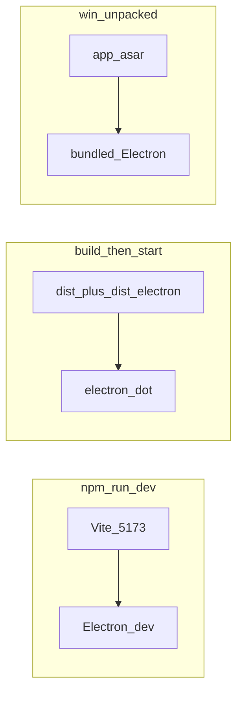

# 015 · 冷启动如何测试：dev / build+start / win-unpacked

> **日期**：2026-07-28  
> **关联**：冷启动加速（Crepe lazy、跳过 `mapConfigItems`、`catalog.load({ force })`）；[05-启动与测试](../05-启动与测试.md)；[013](013-详情Markdown保存最小差异写回-2026-07-28.md) 无关本文测时。  
> **结论（建议）**：测「首屏是否变快」以 **`npm run build` → `npm start`** 与 **`win-unpacked\CursorConfigManager.exe`** 为准；`npm run dev` 只能验功能/懒加载逻辑，**不能**代表发行冷启秒数。`*-portable.exe` 另含自解压，勿与上述混比。

---

## 1. 三种形态差在哪（先看表）

| 维度 | `npm run dev` | `npm run build` + `npm start` | `release\win-unpacked\CursorConfigManager.exe` |
|------|---------------|-------------------------------|--------------------------------------------------|
| **是什么** | Vite 开发服 + Electron 开发窗 | 本仓库已编译的 `dist/` + `dist-electron/`，用本机 `electron .` 跑 | electron-builder 打进 asar 的**解包成品**，自带 Electron 运行时 |
| **绝对路径 / 命令** | `cd e:\Code\CursorConfigManager` → `npm run dev` | 同目录 → `npm run build` → `npm start` | 双击或运行 `e:\Code\CursorConfigManager\release\win-unpacked\CursorConfigManager.exe` |
| **渲染代码从哪来** | Vite `http://localhost:5173`（热更新） | `e:\Code\CursorConfigManager\dist\` | asar 内嵌的同构生产构建（须先 `npm run pack:win` 或等价打包） |
| **主进程从哪来** | Vite 插件产出的 `dist-electron`（开发 watch） | `e:\Code\CursorConfigManager\dist-electron\main.js` | asar 内 `dist-electron/main.js` |
| **preload** | `electron/preload.cjs`（静态） | 同左 | asar / unpacked 内同文件 |
| **是否含 Crepe lazy 分包** | 开发态按模块拆；有 HMR / 预构建缓存干扰 | **是**（生产分包；测首包体积以此为准） | **仅当你重新 `pack:win` 之后**才含最新分包；旧 release 仍是旧包 |
| **首屏 JS 体积是否可对照 1.7MB→0.3MB** | **否**（dev 不走同一套 minify 产物） | **是**（看 `dist\assets\index-*.js` vs `DetailMarkdownCrepe-*.js`） | 同 build 产物打进包；可对 asar 列表确认 |
| **适合测什么** | 功能：懒加载占位「加载编辑器…」、Markdown 能开、双开/对比 | **冷启体感 + 分包正确性**（最接近「生产逻辑」且迭代快） | **真实用户解包目录冷启**（含 asar、打包路径、`sandbox`） |
| **不适合测什么** | 发行秒数、asar 路径、portable 解压 | 「用户拷走文件夹就能用」的完整发行形态 | 热更新 / 改一行立刻看；未重新 pack 时测不到最新代码 |
| **数据路径** | 同一套 `%APPDATA%\CursorConfigManager\` + 永久库 | 同左 | 同左（与开发共用本机 settings/catalog，除非改库根） |
| **典型额外成本** | Vite 冷编译、Milkdown optimizeDeps、可选 Electron 下载 | `build` 本身 0.5～2 min；其后 `start` 无解压 | 无 Vite；无 portable 自解压；杀软首次扫 exe 可能慢 |

**约束（硬）**

1. **勿用浏览器打开** `http://localhost:5173` 测 Electron 功能（无 preload → IPC 全挂）。  
2. **`npm run start` 不会自动 `build`**：改过渲染/主进程后必须先 `npm run build`，否则测的是旧 `dist/`。  
3. **`win-unpacked` 不会自动跟着仓库变**：源码改完后须再跑 `npm run pack:win`（或至少 build + 重新 pack），否则测的是旧发行包。  
4. **`CursorConfigManager-*-portable.exe` 不在本对照三列内**：首启多「自解压到临时目录」一步；与 lazy/Crepe **无关**。日常对比冷启请用 win-unpacked。  
5. **三种形态共用真实库时**：测时不要同时开两个实例写同一 `catalog.json`。



---

## 2. 测什么才叫「冷启动变快」（验收项）

### 2.1 静态产物（不启窗即可）

在 `e:\Code\CursorConfigManager`：

```text
npm run build
```

然后检查 `dist\assets\`：

| 期望（已验证于 2026-07-28 本机一次 build） | 说明 |
|------------------------------------------|------|
| 存在 `DetailMarkdownCrepe-*.js`（约 1.4MB 量级） | 编辑器独立 chunk |
| 入口 `index-*.js`（`dist\index.html` 引用的那个）约 **0.3MB** 量级，**不再**约 1.7MB | 首屏不含 Crepe 核心 |
| `dist\index.html` 的 `<script>` **只**引用入口 `index-*.js`，不直接引用 Crepe chunk | 打开 Markdown 页签才拉 Crepe |

PowerShell 示例：

```powershell
cd e:\Code\CursorConfigManager
Get-Content dist\index.html
Get-ChildItem dist\assets\index-*.js, dist\assets\DetailMarkdownCrepe-*.js |
  Select-Object Name, @{N='KB';E={[math]::Round($_.Length/1KB,1)}}
```

### 2.2 行为冒烟（三种形态都要做一遍逻辑，秒数只在后两种认真比）

| # | 步骤 | 通过标准 |
|---|------|----------|
| 1 | 冷启（见 §3 各形态怎么冷） | 窗体能出；左/中栏有导航与列表（有库数据时） |
| 2 | **先不要**点 Markdown 条目 | 首屏可点工具栏/列表；任务管理器里此时**不应**已为编辑器付满 Crepe 解析（dev 难观察；prod 可用 Network/体积侧证） |
| 3 | 点一条有正文的库条目 → 开 Markdown | 短暂「加载编辑器…」可接受；随后所见即所得可用 |
| 4 | 再开第二条 Markdown（多页签） | 两签都正常；dev 若 `nodes` 红条见 [012](012-详情Markdown多页签Context-nodes-not-found-2026-07-27.md) |
| 5 | 点「对比」（双份时） | 只读 Diff，**不**必加载 Crepe（对比用 `SideBySideDiff`） |

### 2.3 秒表怎么打（建议 / 待你本机填）

统一用手机或 `Measure-Command` 均可；**同一台机器、同一杀软状态、关其它 Electron 实例**。

定义：

- **T0**：双击 / 敲下回车启动的瞬间  
- **T1**：窗口客户区首次出现非白屏骨架（能看见工具栏或三栏轮廓）  
- **T2**：列表区有条目文字（或明确空态文案）  
- **T3**：第一次点开 Markdown 后编辑器可输入  

只比较 **T0→T1 / T0→T2** 跨形态；T3 含 Crepe chunk 下载/解析，允许慢于 T2。

| 形态 | T0→T1（填） | T0→T2（填） | T0→T3（填） | 备注 |
|------|-------------|-------------|-------------|------|
| `npm run build` + `npm start` | | | | 测前已 build 完成，计时从 `npm start` 起 |
| `win-unpacked\…exe` | | | | 须与本次 build **同一次** `pack:win` |
| `npm run dev` | （可选） | （可选） | （可选） | **不作为**快慢结论依据 |

---

## 3. 分形态操作手册

### 3.1 `npm run dev`（开发联调）

```text
cd e:\Code\CursorConfigManager
npm run ensure-electron
npm run dev
```

- 会起 Vite（默认 **5173**）+ Electron。  
- **冷启**：先完全退出 Electron 与占用 5173 的 node，再执行 `npm run dev`。  
- **测 lazy**：首启后不要预点 Markdown；点开时应看到「加载编辑器…」再出编辑器（网络面板可见异步 chunk，dev 下名称因 HMR 可能不同）。  
- **勿**用此形态给「比修复前快多少秒」下结论：还含 Vite 转换、`optimizeDeps`、source map。  
- 若 Markdown 第二签 `nodes`：停 dev → 删 `e:\Code\CursorConfigManager\node_modules\.vite` → 再 `npm run dev`（见 012）。

### 3.2 `npm run build` + `npm start`（生产逻辑、迭代测冷启）

```text
cd e:\Code\CursorConfigManager
npm run build
npm start
```

- `prestart` 可能跑 `ensure-electron`（缺 Electron 时会下载，**第一次**会很长——与 Crepe lazy **无关**，记入备注）。  
- **冷启**：关掉所有 `electron` / `CursorConfigManager` 进程后再 `npm start`。  
- **改代码后**：必须再 `npm run build`，否则 `start` 仍读旧 `dist/`。  
- **体积验收**在 `build` 后做（§2.1）；**体感验收**在 `start` 后做（§2.2）。  
- 与 win-unpacked 的差异：仍用仓库旁的 Node 版 Electron，**不**经 asar；路径解析走 `electron .` + 相对 `dist/`。打包路径 bug 可能只在 win-unpacked 暴露。

### 3.3 `win-unpacked\CursorConfigManager.exe`（发行解包目录）

前置（源码已含 lazy 等改动时）：

```text
cd e:\Code\CursorConfigManager
npm run pack:win
```

成品：

`e:\Code\CursorConfigManager\release\win-unpacked\CursorConfigManager.exe`

- **冷启**：结束所有 CCM / 相关 electron 进程 → 双击上述 exe。  
- **确认测的是新包**：看 `release\` 文件时间是否晚于你改代码的时间；或对 asar 抽查是否存在 `DetailMarkdownCrepe` 资源名（打包后文件名可能哈希不同，但应有独立大 chunk）。  
- **与 `npm start` 应对齐的行为**：首屏快、开 Markdown 才加载编辑器、对比不依赖 Crepe。  
- **不要**用同目录旁的 `CursorConfigManager-*-portable.exe` 代替本项来比「代码优化」效果。

---

## 4. 常见误判

| 误判 | 实际 |
|------|------|
| 「dev 还是慢 → 优化无效」 | dev 慢主因常是 Vite/预构建；看 `dist` 体积与 `build`+`start` |
| 「没 re-pack，win-unpacked 还是慢」 | 旧包未含 lazy；须 `pack:win` |
| 「portable 仍慢 → lazy 失败」 | portable 首启自解压主导；改用 win-unpacked 对照 |
| 「一开软件就加载 Crepe chunk」 | 若首屏就拉 Crepe，检查是否误静态 import，或某处预打开了 Markdown 页签 |
| 「两种 Electron 同时开，列表乱/变慢」 | 双实例抢同一 catalog |

---

## 5. 与本次代码改动的对应关系

| 改动 | 在哪种形态能验到 |
|------|------------------|
| `DetailMarkdownCrepe` → `React.lazy` | 三种都能验行为；**体积**只看 `build` 产物 / 新 pack |
| `configItems: []`（跳过 `mapConfigItems`） | 主进程路径；三种都走 `getSnapshot`；大 `~/.cursor` 时 `build`+`start` / unpacked 更易感到列表更快出现 |
| `catalog.load({ force })` 短路 | 同左；第二次 IPC 快照不应再整表 `readFileSync`+infer（可用主进程日志/断点验，非必须） |

---

## 6. 文档索引

- 日常启动命令：[05-启动与测试](../05-启动与测试.md)「启动步骤」「发行路径」  
- 多页签 dev 坑：[012](012-详情Markdown多页签Context-nodes-not-found-2026-07-27.md)  
- sandbox：[014](014-sandbox与危险IPC评估-2026-07-28.md)

**版本**：v1.0 | **状态**：测试手册（秒表格待本机填写）
