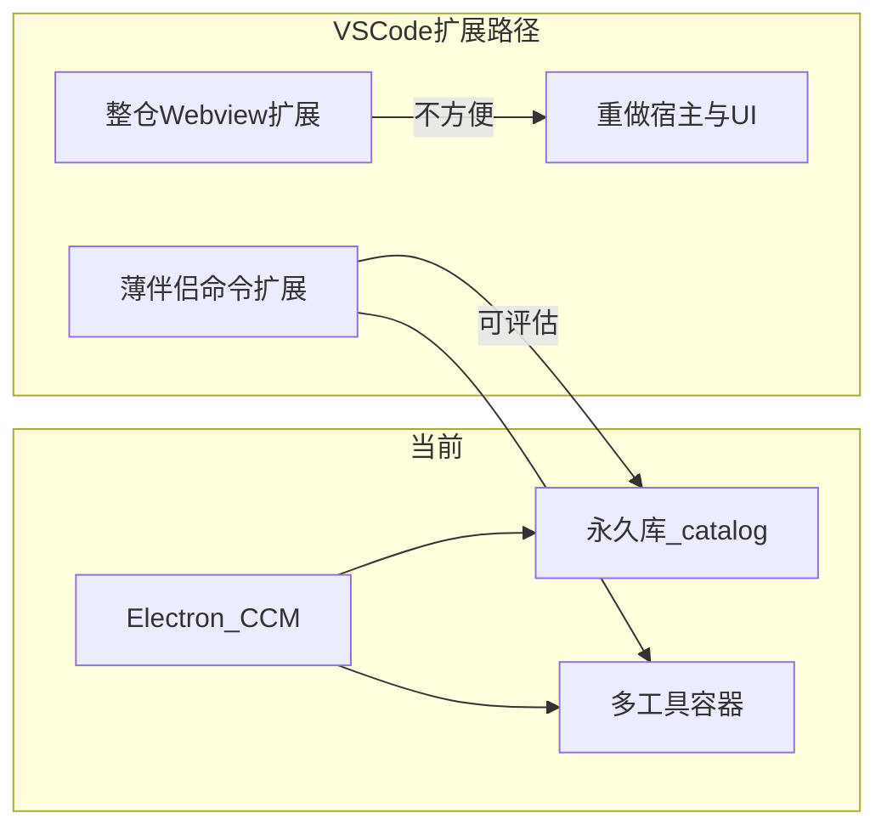

# 016 · 做成 VS Code 扩展可行性

> **日期**：2026-07-29  
> **关联**：[01-项目架构](../01-项目架构.md)；[08-程序核心逻辑](../08-程序核心逻辑.md) §5.4；[002-WebView2与Electron对比](002-WebView2与Electron对比-2026-07-21.md)  
> **结论（建议）**：**整仓迁成 VS Code 扩展不方便**（接近第二产品）；**薄伴侣扩展可评估**；**Cursor Plugin 配置包不对口**（管理器 ≠ 一份可安装规则集）。近期仍以 Electron 桌面为主产品。

---

## 1. 先消歧：Extension ≠ Plugin

| 形态 | 是什么 | 起什么作用 | 与 CCM 的关系 |
|------|--------|------------|---------------|
| **VS Code Extension**（扩展） | 编辑器插件，打包为 `.vsix`；用 Extension Host（扩展宿主进程）跑 `vscode.*` API | 命令、侧栏、Webview（嵌入式网页面板）等编辑器内能力 | **本文主线**：能否把 CCM 做成这种扩展 |
| **Cursor Plugin**（插件包） | Marketplace 分发的 AI 配置包：rules / skills / agents / commands / hooks / MCP（Model Context Protocol，给 Agent 接外部工具） | 安装后向 Agent 注入约定组件 | **不对口（已验证·模型）**：CCM 是「管这些资产的管理器」，不是「一份可安装的配置包」 |
| **CCM 容器** | 工具约定读取的磁盘目录（如 `~\.cursor`、项目 `.cursor`） | 文件放入后才可能被工具调用 | 桌面版已在管；扩展若只写盘，语义不变 |

装进 **Cursor** 时：多数走 **VS Code 兼容扩展**（Open VSX 注册表 + Cursor 市场代理，或本地 Install from VSIX），**不是** Plugin 市场。下文只深挖 Extension。

---

## 2. 现状：CCM 是独立桌面壳

**已验证**（对照 `package.json`、仓库检索、[01](../01-项目架构.md)）：

| 项 | 事实 |
|----|------|
| 交付 | Electron 42.5 + React/Vite；`electron-builder` → portable / `win-unpacked` |
| 入口 | `main`: `dist-electron/main.js`；IPC：`ccm.invoke`（preload → main） |
| 扩展脚手架 | **无** `engines.vscode`、`extension.ts`、`contributes`、`@types/vscode` |
| 与编辑器耦合 | **无**进程内 API；只读写磁盘容器与永久库 |
| 设置落点 | `%APPDATA%\CursorConfigManager\settings.json`；台账 `{永久库}\catalog.json` |
| 能力重心 | 永久库权威定稿、多盘符发现项目、Deploy/Withdraw 哈希对账、大三栏工作台 + Crepe（Milkdown 编辑器） |

---

## 3. 整仓迁成 Extension：要改什么

**结论（建议）**：不是改 packaging，而是换宿主 + 重做大 UI + 收窄发现范围。

| 现状 | 扩展侧必须换成 | 难度 |
|------|----------------|------|
| `electron/main` + preload IPC | `activate` + Extension Host；命令/TreeView/Webview 消息 | 高 |
| 无边框独立窗 + 三栏工作台 | WebviewPanel / 自定义编辑器 / 活动栏视图 | 高（UI 体量） |
| 多盘符 Discovery（默认可扫可读盘） | 限当前工作区，或显式选根；全盘扫非扩展常态，权限/信任提示更重 | 高 |
| 同时管 Claude / Codex 用户目录 | 仍可用 Node `fs` 写盘，但产品心智绑「当前编辑器」 | 中 |
| Crepe 详情 Markdown | Webview 内嵌同一套，或退化用内置 Markdown 预览/编辑 | 中高 |
| `%APPDATA%\CursorConfigManager` | 可保留路径，或迁到 `globalStorage`（扩展全局存储目录） | 低 |

**分发（已验证·官方）**：VS Code 可走 Microsoft Marketplace；Cursor 侧默认 **Open VSX** + `marketplace.cursorapi.com` 代理扫描，覆盖与签名/企业白名单可能与微软市场不一致（[Extensions 帮助](https://cursor.com/help/customization/extensions)）。双编辑器都装 → **待验证** 是否要维护两套上架或只侧载 VSIX。

**引擎卡口（待验证）**：扩展 `engines.vscode` 若高于 Cursor 声明的 API 版本，可能装不上或行为差——上线前用本机 Cursor 实测。

---

## 4. 可复用什么、仍要付什么成本

**可复用（推断）**：`electron/services/*`（如 catalog、scan、ingest、pathRules、projectDiscovery）与 `shared/` 的路径/台账/哈希逻辑，可抽成**纯 Node 库**，Electron 与 Extension 各挂适配层。

**仍要付的成本（建议）**：上述抽离本身是架构拆分；IPC 面、窗口生命周期、UI 壳、发现 UX 都要重做。工作量定性接近**第二产品**，不是「换壳打包」。

---

## 5. 薄伴侣方案（建议边界，非立项）

只在编辑器里补「当前工作区」快捷入口；**桌面 CCM 仍为主产品**。

| 做 | 不做 |
|----|------|
| 命令：部署库中选中资产 → 当前工作区 `.cursor`（或等价 kind 路径） | 全量台账三栏 UI |
| 命令：在资源管理器/编辑器打开库内路径 | 多盘符全盘扫描 |
| 可选：列出永久库条目的简易 TreeView | 跨工具运维总控、独立备份窗 |
| 复用共享 Node 库的 Deploy/路径规则 | 指望扩展写入 Settings → User Rules |

**与 Rule 生效裂缝的关系（已验证·本机 Docs/08 §5.4）**：扩展把 `.mdc` 写到 `~\.cursor\rules` **同样不等于**全局 User Rules；要让当前项目 Agent Always Apply，仍应部署到 **`{项目}\.cursor\rules`**。薄伴侣对「当前工作区部署」反而更贴合真实生效路径。

---

## 6. 相对桌面壳的得失

| | 得 | 失 |
|---|----|----|
| **整仓扩展** | 安装入口在 Extensions 面板；与工作区同进程 | 独立运维窗消失；全盘/跨工具心智削弱；Webview 性能与发行双市场成本 |
| **薄伴侣** | 「在当前项目点一下部署」；改动面小 | 不能替代桌面做库生命周期；用户仍要装/开桌面 app 做重操作 |

Cursor 增量 API（如 `vscode.cursor.mcp.registerServer`）对「配置管理器」**非刚需**；写盘仍靠 `fs` / `vscode.workspace.fs`。

---

## 7. 决策建议

1. **近期不主推整仓扩展化**（建议）。  
2. **若明确需要「在 VS Code/Cursor 里一键部署到当前工作区」**，再单独立项薄伴侣扩展；先抽共享 Node 库再挂两边适配（建议）。  
3. **不要**把 CCM 改造成 Cursor Plugin 包上架（已验证·模型错位）。  
4. 用户级 Rule 全局生效缺口：**扩展也补不上**；产品提示仍指向 Settings → Rules 或项目级部署（已验证）。

---

## 8. 证据汇总

| 结论 | 级别 | 依据 |
|------|------|------|
| 当前是 Electron 桌面，无扩展脚手架 | 已验证 | `package.json`；全仓无 `engines.vscode` / `@types/vscode` |
| 与 Cursor 仅文件路径耦合 | 已验证 | [01](../01-项目架构.md)、[08](../08-程序核心逻辑.md) |
| `~\.cursor\rules` ≠ User Rules | 已验证 | Docs/08 §5.4 本机探测 |
| Cursor 装扩展走 Open VSX + 代理 | 已验证 | [cursor.com/help/customization/extensions](https://cursor.com/help/customization/extensions) |
| Plugin = 配置包，非管理器 UI | 已验证 | [cursor.com/docs/plugins.md](https://cursor.com/docs/plugins.md) |
| 整仓迁扩展不方便 / 薄伴侣可评估 | 建议 | 由宿主与能力对照推断；未做原型 |
| 双市场上架与 `engines.vscode` 卡口 | 待验证 | 上线前本机 Cursor/VS Code 实测 |

**官方链接**：Extensions 帮助 · Plugins 文档 ·（可选）[extension-api](https://cursor.com/docs/extension-api)

---

**版本**：v1.0 | **更新**：2026-07-29
