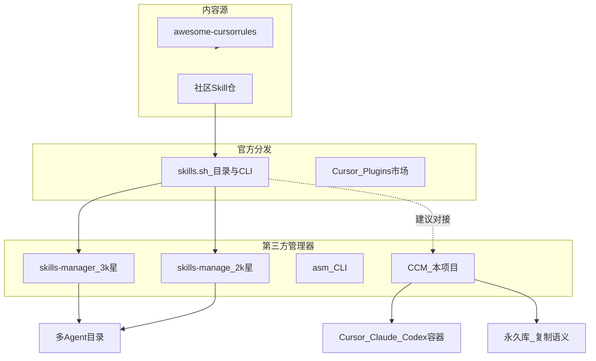

# 017 · 商业前景与运营调研

> **日期**：2026-07-29  
> **关联**：[03-当前状态](../03-当前状态.md)；[04-下一步计划](../04-下一步计划.md)；[016-做成VSCode扩展可行性](016-做成VSCode扩展可行性-2026-07-29.md)  
> **结论（建议）**：**直接卖软件前景弱**；**品类需求真实且在爆发期**。继续投入的合理动力是「开源声誉 + 生态卡位」，不是近期变现。扩充「收集整理开源 Skills」应对接 [skills.sh](https://skills.sh)（Vercel 维护的 Agent Skills 目录与排行榜），并以**安全审查 + 本地整理 + 编辑**区隔竞品。

---

## 1. 决策摘要（先给结论）

| 问题 | 答案 | 级别 |
|------|------|------|
| 有没有商业前景？ | **直接卖桌面授权：弱**。同类工具几乎全免费开源；官方分发（skills.sh、Cursor Plugins）免费且强势。 | 推断 |
| 值不值得继续维护？ | **值**——若目标是自用闭环 + 开源影响力；品类在 2026 上半年爆发，头部未定。 | 建议 |
| 近期变现预期？ | **不要当收入预期**。赞助 / 团队版最多作远期可选项。 | 建议 |
| Skills 收集功能怎么切？ | 对接 skills.sh 作发现源 → 落入永久库；导入时做基础安全提示。 | 建议 |

**动力定位（建议）**：一阶目标 = 把 CCM（Cursor Config Manager，本项目：永久库 ↔ 多工具容器的配置管理器）做成「Windows 上可信的本地 Skills/Rules 工作台」；商业化为二阶、可推迟。

---

## 2. 品类在爆发：需求已验证

**结论（已验证）**：跨工具管理 Agent Skills（按 `SKILL.md` 标准打包的 Agent 能力包）是刚需；竞品在数月内拿到数千星，说明市场在扩，不是伪需求。

| 仓库 | 形态 | 星标 | 创建→最近推送（UTC） | 要点 |
|------|------|------|-------------------|------|
| [xingkongliang/skills-manager](https://github.com/xingkongliang/skills-manager) | Electron 桌面 | **3399** | 2026-03 → 2026-07 | 15+ agents；统一库；接入 skills.sh 搜索 |
| [iamzhihuix/skills-manage](https://github.com/iamzhihuix/skills-manage) | Tauri 桌面 | **2136** | 2026-04 → 2026-05 | 20+ 平台；中央库 `~/.agents/skills/` + **symlink**（符号链接：一处正本、多处挂载） |
| [luongnv89/asm](https://github.com/luongnv89/asm) | CLI / TUI | **760** | 2026-03 → 2026-07 | Bun；多 agent；重复审计 |
| [yibie/skills-manager](https://github.com/yibie/skills-manager) | macOS 原生 | **357** | 2026-04 → 2026-04 | 多 agent；含中文摘要 |
| [PatrickJS/awesome-cursorrules](https://github.com/PatrickJS/awesome-cursorrules) | 内容列表 | **~4 万** | 持续 | 非管理器；证明「规则内容」流量巨大 |

星标数：**已验证**（2026-07-29 调 GitHub API）。awesome-cursorrules 约数以 README/检索为准，数量级正确即可。

---

## 3. 官方生态：挤压与机会

**结论（已验证·官方）**：发现与安装正被官方 CLI/市场收走；第三方若只做「再包一层安装」，价值会被压扁。机会在**本地生命周期、冲突、编辑、安全**。

| 渠道 | 是什么 | 起什么作用 | 对 CCM |
|------|--------|------------|--------|
| **skills.sh** + `npx skills` | Vercel 背书的开放 Agent Skills 目录与 CLI | 搜索/安装到 Cursor 等数十个 agent；社区报道称跟踪大量 skill 与安装量 | **收集功能必须对接的事实标准**（建议） |
| **Cursor Plugins** | Marketplace 配置包（rules/skills/agents/…） | 一键注入 Agent 约定 | **不对口**（管理器 ≠ 配置包）；见 [016](016-做成VSCode扩展可行性-2026-07-29.md) |
| Claude `/plugin` 等 | 各工具原生插件 | 单工具内分发 | CCM 仍管磁盘侧；不替代原生安装 |

**安全空白（已验证·报道 + 推断产品缺口）**：2026-01 前后 ClawHub（OpenClaw 技能市场）出现大规模恶意 skill 投毒报道（数百恶意包量级）。skills.sh 侧重安装量排行，**不等于**本地导入前的安全审查。竞品多做「装得快」；**「装得安心 + 本地可审可改」仍是差异化空白（建议）**。

---

## 4. CCM 相对竞品：差异与劣势

**结论（建议）**：不要和 skills-manager 比「覆盖 agent 数量 / 市场浏览」；要比「库权威 + 双份冲突 + 可编辑」。

| 维度 | CCM（现状） | 头部竞品（典型） |
|------|-------------|------------------|
| 部署语义 | **复制** + 双份态 + 哈希对账 + 冲突决议 | 多为 **symlink** 或单向 sync |
| 资产范围 | skills / rules / agents / commands / hooks | 多数偏重 skills |
| 编辑 | Crepe（Milkdown）WYSIWYG + 最小差异写回 | 预览为主，深编辑弱 |
| 平台 | Windows 便携包优先 | 多跨平台；有 macOS 原生 |
| 市场对接 | **无** | 已接 skills.sh |
| 维护 | 个人；产品已到 P3 打磨 | 社区星标已起量 |

**劣势（已验证·本仓）**：无公开 GitHub 流量叙事、无市场搜索、无 CLI、仅 Windows 发行、起步晚于 2026 年 Q1–Q2 竞品潮。

**优势（已验证·本仓能力）**：永久库权威定稿、多容器发现、刷新冲突窗、详情编辑与双开对比——这是「工作台」而非「安装器」。

---

## 5. 商业化现实：为何「直接卖」弱

**结论（推断）**：付费墙难立在「个人装几个 skill」上。

| 路径 | 可行性 | 说明 |
|------|--------|------|
| 个人买断 / 订阅桌面版 | 低 | 竞品免费；官方 CLI 免费；用户愿付费意愿弱 |
| GitHub Sponsor / 捐赠 | 低–中 | 需先有星标与使用故事；收入不稳定 |
| 团队 / 企业：私有库、策略同步、审计报表 | 中（远期） | 付费点在合规与协作，不在「会安装」 |
| 安全扫描增值 / Pro | 中（远期） | 呼应投毒痛点；需可信扫描能力与声誉 |
| 做 skills 内容站赚流量 | 与产品弱相关 | awesome 路线；CCM 不必转行 |

独立软件售卖基础设施（如 Keylight、Polar、Keygen 等）**存在**，但对本项目是「有能力再接」的备查，不是近期必做（建议）。

---

## 6. 运营：按投入档位选

**结论（建议）**：默认走**中档**——正好对齐「扩充开源 Skills 收集整理」；低档保底自用；高档等有用户再谈钱。

### 6.1 低档（保底，维持动力成本最低）

- 开源上架 GitHub；中英 README；Release 挂 `portable` / `win-unpacked`。
- 不追社区运营；当自用 + 简历/作品集。
- **适合**：精力紧、只求「工具继续为自己服务」。

### 6.2 中档（推荐）

1. **产品**：接入 skills.sh（搜索/一键落入永久库）+ 导入安全提示（见 §7）。  
2. **叙事**：一句话——「Windows 上可审可改的 Skills/Rules 本地工作台，不是又一个安装器」。  
3. **渠道**：V2EX / 掘金 / 少数派式长文；英文 HN / r/cursor / r/ClaudeAI（有成品再发）。  
4. **节奏**：每完成一块可演示能力发一版 Release 笔记；不追求日更。

### 6.3 高档（远期可选）

- 团队私有库同步、策略包、审计导出 → Pro。  
- 付费通道用现成 Merchant of Record / License SDK；**先验证有没有「愿意付钱的团队」再做门禁**。

---

## 7. Skills「收集整理」功能：切入建议

**结论（建议）**：收集 = 对接官方目录；整理 = 复用永久库 + 分层/标签；安全 = 导入闸门。不要自建第二市场。

| 步骤 | 做什么 | 复用 |
|------|--------|------|
| 发现 | 调 skills.sh / `npx skills` 生态（列表、搜索、安装源） | 外源；不自爬全网 |
| 入库 | 下载/解包 → ingest 进永久库，写 catalog | 现有 Scan / Ingest / catalog |
| 整理 | L0/L1/L2、标签、去重、冲突决议 | 现有分层与冲突窗 |
| 部署 | 复制到 Cursor / Claude / Codex 容器 | 现有 Deploy / Withdraw |
| 安全（差异化） | 导入前标红：含脚本、外连、可疑权限；保留来源 URL 与哈希 | 新产品面；先规则提示，后可加深 |

**边界（建议）**：CCM 不做「官方市场替代品」；做「从官方/社区装进来之后的本地权威库」。与 [016](016-做成VSCode扩展可行性-2026-07-29.md) 一致：主产品仍是 Electron 桌面，不靠 Plugin 上架变现。

---

## 8. 是否继续投入：决策框

| 若你的真实目标是… | 建议 |
|-------------------|------|
| 自己多项目、多工具配置不乱 | **继续**；低/中档均可；收集功能直接提高自用价值 |
| 半年内靠 CCM 赚钱 | **降预期或不押宝**；品类赚钱点在团队/安全，尚未验证 |
| 开源影响力 / 作品集 | **继续中档**；Skills 收集是最易对外讲清的增量 |
| 与 skills-manager 拼星标第一 | **不建议**；改拼「复制语义工作台 + 安全 + 中文 Windows」细分 |

**综合建议**：继续维护有理；动力应挂在「自用刚需 + 开源卡位」，不是「商业变现倒计时」。下一产品增量优先做 skills.sh 对接与导入安全提示。

---

## 9. 证据汇总

| 结论 | 级别 | 依据 |
|------|------|------|
| skills-manager 3399 星等竞品星标 | 已验证 | 2026-07-29 GitHub API |
| 品类需求真实、爆发中 | 已验证 | 上表创建时间与星标增速 |
| skills.sh 为事实标准目录/CLI | 已验证 | [vercel.com/docs/agent-resources/skills](https://vercel.com/docs/agent-resources/skills)；[vercel-labs/skills](https://github.com/vercel-labs/skills)；[skills.sh](https://skills.sh) |
| Cursor Plugin ≠ 管理器产品 | 已验证 | [016](016-做成VSCode扩展可行性-2026-07-29.md)；Cursor Plugins 文档 |
| CCM 复制语义 / 双份 / Crepe / Win 便携 | 已验证 | [03](../03-当前状态.md)、本仓代码与 Docs |
| ClawHub 恶意 skill 投毒量级 | 已验证·二手 | 2026 社区报道（如 skills.sh 指南类文章引述）；非本机复现 |
| 直接卖软件前景弱 | 推断 | 免费竞品 + 官方免费分发 |
| 中档运营 + 对接 skills.sh + 安全差异化 | 建议 | 由格局与 CCM 能力对照 |
| 团队 Pro / License 变现 | 建议·远期 | 未做付费验证；待验证 |

---

**版本**：v1.0 | **更新**：2026-07-29
