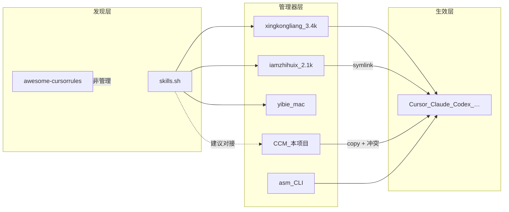

# Agent Skills 管理器 · 市场格局与产品调研

> **调研日期**：2026-07-29  
> **目标形态**：桌面（Windows 优先；Electron 已落地）  
> **一句话目标**：为多工具个人开发者提供「永久库权威 + 复制部署 + 可审可改」的本机 Skills/Rules 工作台，而不是又一个装机器。  
> **关联**：[017-商业前景与运营调研](017-商业前景与运营调研-2026-07-29.md)；[016-做成VSCode扩展可行性](016-做成VSCode扩展可行性-2026-07-29.md)；[08-程序核心逻辑](../08-程序核心逻辑.md)  
> **方法**：按 L1G90（软件产品调研：立项前把「做什么 / 怎么做」写成报告的流程）五阶段；竞品星标 **已验证**（本机 GitHub API，2026-07-29）；技术栈以各仓 README 为准。

**结论（建议）**：品类真实且头部已起量；**不要拼 agent 覆盖数与市场浏览**。CCM（Cursor Config Manager，本项目）应锚定三条差异化：**复制语义 + 双份冲突决议**、**多资产类型（skills/rules/agents/…）深编辑**、**导入安全闸门 + skills.sh 发现**。构建方式：**继续自研底座**（已有 Electron/Copy/冲突/Crepe），外接 skills.sh，不 Fork 头部桌面仓。

---

## 0. 目标与约束

| 项 | 内容 |
|----|------|
| 核心功能 | 永久库 ↔ 多工具容器的配置台账、部署/收回、冲突对账与正文编辑 |
| 目标用户 | 个人开发者：多项目、多工具（Cursor / Claude / Codex 等）、同名多版本失控 |
| 平台形态 | **假设**：继续 Windows 便携桌面为主；跨平台与 CLI 非本期必达 |
| 关键约束 | 开源叙事优先（见 017）；个人维护；不做成第二市场；工作面隔离（管路径，不解释 skill 语义） |
| 成功标准 | 自用闭环稳定；对外能讲清「工作台 ≠ 安装器」；skills.sh 可发现并入库；导入有基础安全提示 |
| 五维权重 | 功能 **25%** / 易用 **25%** / 可靠安全 **20%** / 稳定 **15%** / 差异化 **15%**（合计 100%） |

**权重理由（假设）**：工具类高频生产 → 易用与功能并列；安全投毒已成行业痛点 → 可靠安全抬到 20%；差异化用于找空白，不追求「全面最高分」。

---

## 1. 竞品清单

**星标说明（已验证）**：下表「星标」列为本机 `api.github.com` 当日读数。用户口述「3.4k / 2.1k / 357 / 40k」与 API **一致**（取整口径）。`aclemen1/csm` 仓库名 **404**；对应产品为 [`aclemen1/claude-skill-manager`](https://github.com/aclemen1/claude-skill-manager)（CLI 名 `csm`），星标 **1**。

### 1.1 直接竞品（同类管理器）

| 名称 | 形态 | 平台 | 商业模式·价格 | 开源? | 活跃度（最近推送 UTC） | 链接 | 一句话定位 |
|------|------|------|---------------|-------|----------------------|------|------------|
| xingkongliang/skills-manager | 桌面 + CLI | 跨平台（Tauri 2） | 免费开源 | MIT | 2026-07-14；3399★ | [GitHub](https://github.com/xingkongliang/skills-manager) | 统一库 + skills.sh 市场 + Preset/多工作区；symlink **或** copy |
| iamzhihuix/skills-manage | 桌面 | 跨平台（Tauri v2；发行偏 macOS） | 免费开源 | Apache-2.0 | 2026-05-02；2136★ | [GitHub](https://github.com/iamzhihuix/skills-manage) | `~/.agents/skills/` 中央库 + **symlink** 到 20+ 平台 |
| yibie/skills-manager | 桌面原生 | **仅 macOS**（SwiftUI） | 免费开源 | MIT | 2026-04-27；357★ | [GitHub](https://github.com/yibie/skills-manager) | 40+ agents；skills.sh 发现；**中文摘要/翻译** |
| luongnv89/asm | CLI + TUI | Node 跨平台 | 免费开源 | MIT | 2026-07-29；760★ | [GitHub](https://github.com/luongnv89/asm) | 一命令管多 agent；安装前 **security audit** |
| aclemen1/claude-skill-manager（csm） | CLI + TUI | Python | 免费开源 | MIT | 2026-05-18；1★ | [GitHub](https://github.com/aclemen1/claude-skill-manager) | **仅 Claude Code**；库→项目 symlink |

**技术栈更正（已验证·README）**：`xingkongliang/skills-manager` 为 **Tauri 2 + Rust + React**，**不是 Electron**。用户口头「Electron」与事实不符，对比时勿再误标。

### 1.2 间接替代

| 名称 | 形态 | 说明 |
|------|------|------|
| [skills.sh](https://skills.sh) + `npx skills` | 官方目录 / CLI | 发现与安装事实标准；挤压「只会装」的第三方 |
| Cursor Plugins Marketplace | IDE 市场 | 分发配置包；**≠** 本机生命周期管理器（见 016） |
| 手工复制 / 自写脚本 / Git 裸仓 | 间接 | 零软件成本；无台账、无冲突 UI |

### 1.3 邻域参考

| 名称 | 形态 | 星标 | 链接 | 一句话 |
|------|------|------|------|--------|
| PatrickJS/awesome-cursorrules | 纯内容列表 | **40456★** | [GitHub](https://github.com/PatrickJS/awesome-cursorrules) | 证明「规则内容」流量巨大；**不做**部署/对账 |

---

## 2. 五维度优缺点分析

评分 **1–5**；未亲自跑全量 UI 的体验分标 **推断**（依据 README / 文档 / 社区叙述）。加权总分 = Σ(得分 × 权重)。

### 2.1 xingkongliang/skills-manager（3399★）

- **优点**：15+ 工具；skills.sh / Git / zip / `.skill` 入库；Preset；全局/项目/链接工作区；symlink 与 copy 可选；Git 备份与多机同步；桌面+CLI 同核。
- **缺点**：功能面极宽，认知负担高；安全审查非主叙事；Windows 用户需与 Tauri 发行习惯磨合；与「只做装机」用户重叠大，差异化易被官方 CLI 削薄。
- **评分（推断）**：功能 5 · 易用 4 · 可靠安全 3 · 稳定 4 · 差异化 4 → **加权 4.05**

### 2.2 iamzhihuix/skills-manage（2136★）

- **优点**：20+ 平台映射清晰；中央库 `~/.agents/skills/` + symlink 单一事实源；集合批量安装；marketplace / GitHub 导入；中英 UI。
- **缺点**：symlink 在 Windows 权限/开发者模式上摩擦大；最近推送停在 2026-05（相对降温）；资产类型仍偏 skills；预构建发行不完整时门槛高。
- **评分（推断）**：功能 5 · 易用 4 · 可靠安全 3 · 稳定 3 · 差异化 4 → **加权 3.90**

### 2.3 yibie/skills-manager（357★）

- **优点**：macOS 原生体验；agents 登记面极广；skills.sh 发现；中文摘要/按需翻译；FSEvents 实时同步；沙箱试跑 skill（产品页宣称）。
- **缺点**：**无 Windows**；对 CCM 目标用户重叠有限；体量小于头部双雄。
- **评分（推断）**：功能 4 · 易用 4 · 可靠安全 3 · 稳定 3 · 差异化 4 → **加权 3.65**（对 mac 用户；对 Win 用户可用性≈0）

### 2.4 luongnv89/asm（760★）

- **优点**：CLI/TUI 双界面；脚本友好（`--json`）；安装前安全扫描与重复审计；持续活跃；自动化/CI 友好。
- **缺点**：无图形工作台；深编辑与可视化冲突弱；对「怕终端」用户门槛高。
- **评分（推断）**：功能 4 · 易用 3 · 可靠安全 **5** · 稳定 4 · 差异化 4 → **加权 3.95**

### 2.5 aclemen1/claude-skill-manager（csm，1★）

- **优点**：Claude 场景 symlink 模型清晰；TUI 库存/目标/安装态；小而专。
- **缺点**：单工具；星标与生态极小；不可作跨工具方案。
- **评分（推断）**：功能 2 · 易用 3 · 可靠安全 3 · 稳定 2 · 差异化 2 → **加权 2.45**

### 2.6 PatrickJS/awesome-cursorrules（邻域，40456★）

- **优点**：内容流量证明品类注意力；易 fork/浏览。
- **缺点**：无部署、无对账、无安全闸；恶意条目靠人工。
- **评分（推断）**：功能 2 · 易用 3 · 可靠安全 1 · 稳定 4 · 差异化 5 → **加权 2.80**（不当管理器对标）

### 2.7 CCM（本项目·对照，已验证·本仓能力）

- **优点**：永久库权威 + **复制**部署；哈希双份冲突窗；skills/**rules**/agents/commands/hooks；Crepe WYSIWYG + 最小差异写回；Windows 便携路径清晰。
- **缺点**：无 skills.sh；无 CLI；agent 覆盖少于头部；无公开星标叙事；导入安全闸未产品化。
- **评分（推断·自评对照）**：功能 3.5 · 易用 3.5 · 可靠安全 2.5 · 稳定 3 · 差异化 **5** → **加权 3.45**

### 汇总对比

| 竞品 | 功能 | 易用 | 可靠安全 | 稳定 | 差异化 | 加权总分 | 一句话总评 |
|------|------|------|----------|------|--------|----------|------------|
| xingkongliang/skills-manager | 5 | 4 | 3 | 4 | 4 | **4.05** | 功能最全的跨平台桌面头部 |
| luongnv89/asm | 4 | 3 | 5 | 4 | 4 | **3.95** | 安全与自动化最强的 CLI 路线 |
| iamzhihuix/skills-manage | 5 | 4 | 3 | 3 | 4 | **3.90** | symlink 中央库、平台最广之一 |
| yibie/skills-manager | 4 | 4 | 3 | 3 | 4 | **3.65** | mac 原生 + 中文；Win 空白 |
| CCM（本项目） | 3.5 | 3.5 | 2.5 | 3 | 5 | **3.45** | 工作台语义最清晰；发现/安全待补 |
| awesome-cursorrules | 2 | 3 | 1 | 4 | 5 | 2.80 | 内容集合，非管理器 |
| csm（Claude only） | 2 | 3 | 3 | 2 | 2 | 2.45 | 窄场景参考 |

### 行业现状小结

- **普遍做得好**：多 agent 路径映射、中央库、skills.sh/Git 安装、批量启用；头部桌面用 Tauri，CLI 用安全扫描讲故事。
- **普遍短板**：symlink 主导 → Windows/权限与「库内改、容器内改」双份语义弱；**深编辑 + 最小 diff 写回**少；**导入安全**多停留在扫描口号或未做；**rules/agents/hooks** 与 skills 同权管理少；官方 CLI 正在收走「只会装」的价值。

---

## 3. 我应当做的产品

### 3.1 机会矩阵（痛点 × 竞品满足度）

| 用户痛点 | 头部桌面 | asm | 官方 skills.sh | CCM 现状 | 机会 |
|----------|----------|-----|----------------|----------|------|
| 装得快、搜得到 | 高 | 高 | **高** | 低 | 对接即可，不自建市场 |
| 同名多版本 / 双份冲突 | 低–中 | 低 | 无 | **高** | **主战场** |
| 可审可改正文 | 中（预览为主） | 低 | 无 | **高** | **主战场** |
| 导入防投毒 | 低–中 | **高** | 低（排行≠安全） | 低 | **应补的差异化** |
| Win 便携 + 复制语义 | 中（symlink 多） | 中 | n/a | **高** | 保持 |
| 仅 mac 体验 | yibie 高 | — | — | 无 | **不做** mac 原生本期 |

### 3.2 一句话定位

为【Windows 上多工具、多项目的个人开发者】提供【永久库权威、复制部署、冲突可决、正文可改的本地工作台】，区别于【xingkongliang / iamzhihuix 等装机型管理器】之处在于【**Copy + 哈希冲突 + 多资产编辑**，并补齐 skills.sh 发现与导入安全提示】。

### 3.3 目标用户画像

| | 场景 | 痛点 | 当前替代 |
|--|------|------|----------|
| **主** | Win；Cursor+Claude+Codex；库里堆几十份 skill/rule | 不知哪份定稿；装完不敢改 | 手工复制 / 已装竞品但不满意冲突 |
| **次** | 愿开源试用的同好；要「中文 Windows 工作台」叙事 | 头部偏 symlink / 英文社区 | skills-manager / asm |

### 3.4 MVP 功能集（MoSCoW）— 相对「下一增量」

| 优先级 | 含义 | 功能 |
|--------|------|------|
| **Must** | 没有则定位塌陷 | 永久库权威；Copy 部署/收回；同名哈希冲突决议；skills+rules 等现有资产类型；详情可编辑写回 |
| **Should** | MVP 后紧接 | **skills.sh 搜索/一键入库**；导入安全提示（脚本/外连/可疑模式标红 + 来源 URL/哈希） |
| **Could** | 锦上添花 | 更多 agent 路径；轻量 CLI；Preset 类批量策略；中英 README/发行页 |
| **Won't(now)** | 明确不做 | 自建第二市场；整仓迁 VS Code 扩展（见 016）；拼 20+ agent 覆盖第一；mac 原生重写；付费门禁 |

### 3.5 非功能目标（可量化·建议）

| 目标 | 指标 |
|------|------|
| 核心部署流 | 库→容器生效 ≤ 3 步（已有交互应保持） |
| 冲突可决 | 同名异哈希必弹窗，禁止静默覆盖（已验证·本仓约定） |
| 发现入库 | skills.sh 关键词搜索 → 落入永久库 ≤ 2 分钟（含下载解包，待实现后测） |
| 安全闸 | 含可执行脚本/明显外连的 skill 导入前必有可见警告（待实现） |

### 3.6 差异化锚点

1. **复制语义工作台**（非默认 symlink 中央库）  
2. **双份冲突 + 权威定稿**  
3. **多资产 + 深编辑**（Crepe / 最小 diff）  
4. **（待建）发现对接 skills.sh + 导入安全** — 与 017 一致  

### 3.7 不做清单

- 不做「星标第一」竞赛  
- 不做官方市场替代爬虫站  
- 不做内容写作教练 / skill 语义解释器（工作面隔离）  
- 不本期 Fork 头部 Tauri 仓换壳  

---

## 4. 最优实现路径

### 4.1 构建方式

| 方式 | 判定 |
|------|------|
| **推荐：继续自研底座 + 外接标准源** | 差异化在 Copy/冲突/编辑/台账，已在 Electron 仓落地；Fork skills-manager 会换架构、丢现有语义 |
| 备选：Fork 头部 Tauri | 仅当放弃 Copy 工作台、改做装机器时才合理——**与定位矛盾** |
| 不推荐：从零重写 / 纯 SaaS | 无必要；数据应本地优先 |

### 4.2 技术选型（默认 + 备选）

| 层 | 默认（已验证·本仓） | 备选 |
|----|---------------------|------|
| 桌面壳 | Electron 42 + React 19 + Vite | Tauri（成本高、非差异化所需） |
| 业务 | Node fs + TypeScript services | — |
| 台账 | `catalog.json` + 永久库目录 | SQLite（仅当规模与查询成为瓶颈） |
| 编辑 | Crepe / Milkdown | 纯 textarea（降级） |
| 发现源 | skills.sh / vercel-labs/skills 生态 API 或 CLI 封装 | 仅 Git URL 手工（现状） |
| 许可 | 本仓自定；对接 MIT/Apache 源注意署名 | — |

### 4.3 架构概要

- **模块**：发现（skills.sh 适配器）→ 入库（ingest / catalog）→ 整理（分层/标签）→ 部署（Copy / Withdraw / 冲突）→ 编辑（详情写回）→ **安全闸（导入前规则提示）**  
- **数据流**：外源包 → 临时解包 → 安全扫描提示 → 永久库正本 → 用户触发复制到容器  
- **风险点**：skills.sh API/CLI 变更；误报导致导入摩擦；Windows 下若未来支持 symlink 需权限策略  

### 4.4 路线图

| 阶段 | 交付物 | 验收点 |
|------|--------|--------|
| **MVP 巩固**（已有能力保底） | Copy/冲突/编辑稳定发行 | 自用主路径无回归；便携包可冷启 |
| **V1** | skills.sh 搜索 + 一键入库 | 能搜到公开 skill 并进永久库；来源可追溯 |
| **V2** | 导入安全提示（规则级） | 含脚本/外连样例必警告；可强制确认后仍导入 |
| 远期 | 更多 agent、可选 CLI、团队审计 | 有真实用户需求再开 |

**最痛先做**：发现缺口（无市场）+ 安全缺口（行业投毒）——功能广度排后。

### 4.5 风险与对策

| 风险 | 类型 | 影响 | 对策 |
|------|------|------|------|
| 官方 CLI 继续收走「安装」价值 | 市场 | 高 | 叙事与功能锁在工作台/冲突/编辑/安全 |
| skills.sh 接口变更 | 依赖 | 中 | 适配器隔离；失败时降级为 Git URL |
| 安全规则误报/漏报 | 技术 | 中 | 先提示不阻断默认；文案标明「启发式非担保」 |
| 头部星标虹吸注意力 | 市场 | 中 | 中文 Win + 复制语义垂直；见 017 中档运营 |
| 个人维护带宽 | 执行 | 高 | Won't 清单；不追 agent 数量竞赛 |

### 4.6 假设验证

| 最危险假设 | 验证手段 |
|------------|----------|
| 用户在有 skills-manager 时仍愿用 CCM | 自用周记 + 对外 Demo：同场景比「冲突/编辑」；收集 3 个外部试用反馈 |
| skills.sh 对接是增长关键增量 | V1 后看：入库次数、是否减少手工 Git |
| 安全提示构成差异化而非噪音 | 用 2–3 个已知风险样例做导入走查；问用户是否觉得多余 |

---

## 5. 结论

做成 **Windows 本地「可审可改」的 Skills/Rules 工作台**：靠 **Copy + 冲突 + 深编辑** 与装机型竞品错位，用 **skills.sh + 导入安全** 补齐发现与信任；**不要**拼 agent 数或 Fork Tauri 头部。第一步（产品增量）：在现有底座上接 skills.sh 入库，并加导入启发式警告——商业预期仍按 [017](017-商业前景与运营调研-2026-07-29.md) 挂在开源卡位而非卖授权。

---

## 6. 证据汇总

| 结论 | 级别 | 依据 |
|------|------|------|
| 星标：3399 / 2136 / 357 / 760 / 40456 / csm=1 | **已验证** | 2026-07-29 GitHub API |
| xingkongliang 技术栈 = Tauri 2，非 Electron | **已验证** | [README Tech Stack](https://github.com/xingkongliang/skills-manager) |
| `aclemen1/csm` 路径不存在；产品为 claude-skill-manager | **已验证** | API 404 + 仓库 README |
| 五维打分与加权 | **推断** | README/文档，非全量实机评测 |
| CCM 能力与定位 | **已验证** | 08 / 01 / 本仓；对照 017 |
| 产品增量优先级（skills.sh + 安全） | **建议** | 机会矩阵 + 017 |
| 不 Fork 头部、不拼覆盖数 | **建议** | 差异化锚点与构建方式 |

---

**版本**：v1.0 | **更新**：2026-07-29
