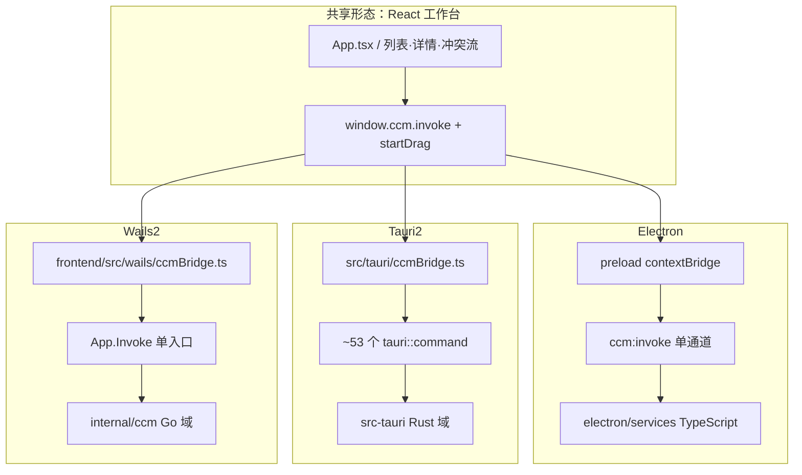

# E003 · CursorConfigManager 三壳架构对比测评

> **迁入说明**：原文写于 `CursorConfigManagerWails2`；2026-07-31 合并入本仓 Evaluations，三壳系列编号顺延为 E003–E007（本仓原有双壳 E001/E002 保留）。  
> **测评编号**：E003（Evaluations 01）  
> **日期**：2026-07-31  
> **结案归档仓**：`E:\Code\CursorConfigManagerTauri2`（原文起草于 Wails2 仓）（并列对照 Electron / Tauri2 / Wails2）  
> **读者**：本人做技术选型与主力线决策时快速翻阅；也可给后续 Agent 作结案依据。

## 0. 总结论

**结论（v1.1 · 已被 E007 裁定）**：三仓均可运行。用户已裁定 **Tauri2 为以后开发主力**；Electron 为维护/对照；Wails2 为壳实验。下文保留 2026-07-31 午前架构对比事实；**选型结论以 [E007](E007-主力线切换Tauri2-2026-07-31.md) 为准**。

| 问题 | 答案 | 证据级别 |
|---|---|---|
| 三仓是否都已生成且可启动？ | **是** | **已验证** |
| 开发主力（2026-07-31 起）？ | **Tauri2** | **已验证**（E007） |
| 谁包体最小？ | Tauri2 ≪ Wails2 ≪ Electron | **已验证** |
| 谁原生文件拖出完整？ | Electron、Tauri2 **有**；Wails2 **无** | **已验证** |

---

## 1. 测评范围与方法

**结论**：本测评覆盖架构、契约、数据隔离、交付体积、开发体验、功能/体验五维评分与场景推荐；性能数字优先引用已落盘的同机实测，不新编未测毫秒数。

### 1.1 三仓身份

| 简称 | 绝对路径 | 壳层（Desktop Shell：把 Web UI 嵌进原生窗口的框架） | 宿主语言 |
|---|---|---|---|
| **Electron** | `E:\Code\CursorConfigManager` | Electron **42.5.0** | TypeScript / Node |
| **Tauri2** | `E:\Code\CursorConfigManagerTauri2` | Tauri **2.11.x**（`tauri` 2.11.5 / CLI 2.11.4） | Rust |
| **Wails2** | `E:\Code\CursorConfigManagerWails2` | Wails **v2.13.0** | Go |

前端共性（三仓一致量级）：**React 19** + **Vite 6** + **TypeScript 5.8** + Milkdown（Markdown 编辑器用的组件栈）等。**已验证**（各 `package.json`）。

### 1.2 方法

| 步骤 | 做法 |
|---|---|
| 身份与版本 | 读 `package.json` / `Cargo.toml`·`Cargo.lock` / `go.mod` / `wails.json` / `tauri.conf.json` |
| 契约 | 数 `IpcMethod`（IPC：Inter-Process Communication，进程间通信）；对照 Go/Rust 路由 |
| 体积 | 本机对发行产物 `Get-Item` 测字节（2026-07-31） |
| 性能 | **引用** 本仓 [E004](E004-三壳冷启动与性能测试-2026-07-31.md)（2026-07-31 三壳实测）；历史对照 Tauri2 仓 E002 |
| 评分 | 五维 1–5 分 + 加权；标注已验证/推断/建议/待验证 |

### 1.3 非目标

- 不裁定「永久废弃」任一仓。  
- 不把 Wails2 立项期「禁读 Tauri2 做移植」与「测评期可读三仓做对照」混为一谈：后者是本文件职责。  
- 不虚构未测的冷启秒表、内存 RSS。

---

## 2. 架构总览

**结论**：三仓共享「React UI ↔ `window.ccm.invoke` ↔ 宿主业务」形态；差异在宿主语言、进程模型、WebView 来源与数据目录策略。



| 维度 | Electron | Tauri2 | Wails2 |
|---|---|---|---|
| UI 目录 | `src/` | `src/` | `frontend/src/` |
| 契约文件 | `shared/ipc.ts` | `shared/ipc.ts` | `frontend/shared/ipc.ts` |
| 桥接 | `electron/preload` | `src/tauri/ccmBridge.ts` | `src/wails/ccmBridge.ts` |
| 业务实现 | `electron/services` ≈ **10.3k** 行 TS | `src-tauri/src` ≈ **10.4k** 行 Rust | `internal/ccm` ≈ **12.6k** 行 Go |
| Web 引擎 | Chromium（随 Electron 自带） | **WebView2**（系统组件） | **WebView2**（系统组件） |
| 无边框窗 | `frame: false` | `decorations: false` | `Frameless: true` |

证据级别：目录与行数 **已验证**（2026-07-31 本机行计数）；Web 引擎归属 **已验证**（框架常识 + 本机 WebView2 / Electron 依赖）。

---

## 3. IPC 契约与功能覆盖

**结论**：Electron 与 Wails2 对齐 **58** 个 `IpcMethod`；Tauri2 为 **63**（多 5 个运维/设置向方法）。前端统一走 `window.ccm` 外观，后端分发形态不同。

### 3.1 方法数量与通道

| 仓 | `IpcMethod` 数 | 后端分发 | 拖出通道 |
|---|---|---|---|
| Electron | **58** | 单通道 `ccm:invoke` + `ccm:start-drag` | Electron `webContents.startDrag` |
| Wails2 | **58**（Go `Method*` 常量一一对应） | `App.Invoke(method, argsJSON)` | `StartDrag` → **剪贴板路径**（非原生拖文件） |
| Tauri2 | **63** | 前端仍 `ccm.invoke`；后端映射多条 `#[tauri::command]` | `tauri-plugin-drag` + 路径解析命令 |

Tauri2 相对多出的方法（文档/类型中出现，**已验证**存在于其 `shared/ipc.ts`）：`openPath`、`updateAppSettings`、`resetCatalog`、`listCatalogBackups`、`restoreCatalogBackup`。这些增强台账备份与设置窗能力，**不在** Electron/Wails2 的 58 集合内。

### 3.2 产品主路径覆盖（定性）

| 主路径 | Electron | Tauri2 | Wails2 |
|---|---|---|---|
| 选库根 / 默认库 | 有 | 有（默认路径不同） | 有（默认同 Electron） |
| 快照 `getSnapshot` | 有 | 有 | 有（曾因 nil→JSON null 白屏，已修） |
| 扫描建库 / 冲突决议 | 有 | 有 | 有（Go 移植；完整 UI 手测 **待验证**） |
| 部署 / 撤回 / 解除管理 | 有 | 有 | 有（实现在 Go；UI 全链路 **待验证**） |
| 项目 CRUD / 扫描项目 | 有 | 有 | 有 |
| 详情 Markdown 写回 | 有 | 有 | 有 |
| 原生拖出到资源管理器 | **有** | **有** | **无**（剪贴板） |
| 设置窗 / 台账五槽备份 | 弱/无独立窗（随主 UI） | **增强** | 对齐 Electron 主路径 |

---

## 4. 数据与隔离策略

**结论**：Electron 与 Wails2 **默认同一把钥匙**（同 settings 路径、同默认库）；Tauri2 **故意分家**，避免姊妹仓互相踩台账。双开 Electron+Wails2 有并发写 `settings.json` 风险。

| 项 | Electron | Tauri2 | Wails2 |
|---|---|---|---|
| Settings 目录名 | `%APPDATA%\CursorConfigManager` | `%APPDATA%\CCM-Tauri2` | `%APPDATA%\CursorConfigManager`（同 Electron） |
| Settings 文件 | `settings.json` | `settings.json` | `settings.json` |
| 默认永久库 | `C:\CursorSkills` | `C:\CursorSkills-Tauri2Spike` | `C:\CursorSkills` |
| 默认 BackupRoot | `E:\cursorBf` | `E:\cursorBf` | `E:\cursorBf` |
| catalog 位置 | `{库根}/catalog.json` | 同规则（库根不同则文件不同） | 同 Electron 默认库根时可共用 |
| 与 Electron 默认同库 | — | **否** | **是** |
| 双开互斥 | 无专门锁 | 因目录隔离，冲突面小 | 与 Electron 双开 → **推断有竞态** |

**建议**：性能/行为对测时，要么只开一壳写盘，要么像 Tauri E002 那样用独立 fixture 库根；不要让 Electron 与 Wails2 同时写同一 `settings.json` 却当独立样本。

---

## 5. 交付体积与运行时

**结论（已验证体积）**：同机发行产物尺寸量级为 **Tauri2 ≪ Wails2 ≪ Electron portable ≪ Electron unpacked**。

| 产物 | 路径（本机） | 大小 | 级别 |
|---|---|---|---|
| Tauri2 release exe | `...\Tauri2\src-tauri\target\release\ccm-tauri2.exe` | **6.4 MB** | **已验证** 2026-07-31 |
| Wails2 release exe | `...\Wails2\build\bin\CursorConfigManagerWails2.exe` | **15.8 MB** | **已验证** 2026-07-31 |
| Electron portable | `...\CursorConfigManager\release\CursorConfigManager-2.0.0-portable.exe` | **94.9 MB** | **已验证** 2026-07-31 |
| Electron 主程序（unpacked） | `...\release\win-unpacked\CursorConfigManager.exe` | **221.6 MB**（单文件；整目录历史约 403 MB） | exe **已验证**；整目录历史见 Electron `Docs/Research/019` **已验证·当时** |
| Electron 引擎目录 | `node_modules\electron\dist` | 历史约 **354 MB** | 见 019；本次未复测整目录 → **推断仍成立** |

**机制说明（简述）**：

- **Electron**：自带 Chromium + Node → 安装/解包巨大，行为最自洽。  
- **Tauri2 / Wails2**：UI 用系统 **WebView2**（Windows 上的嵌入式 Edge 组件），宿主只带业务二进制 → 包体小，但依赖本机已装 WebView2 Runtime。

冷启动秒表：见本仓 [E004](E004-三壳冷启动与性能测试-2026-07-31.md)（T_hwnd **已验证**；列表就绪 T2 **待验证**）。

---

## 6. 性能（域路径）

**结论**：在已公开的同 fixture 对测中，**Tauri2 快照与扫描预览均快于 Electron**；**Wails2 尚未纳入该 bench**，不得宣称名次。

数据来源：`E:\Code\CursorConfigManagerTauri2\Docs\Evaluations\E002-同fixture性能实测对比-2026-07-30.md`（中位，3 轮）。

| 产品 | 快照中位 | 扫描预览中位 | 级别 |
|---|---|---|---|
| Tauri2 | **0.14 ms** | **10.0 ms** | **已验证**（双壳 [E002](E002-同fixture性能实测对比-2026-07-30.md)） |
| Electron（headless 域） | **1.94 ms** | **28.0 ms** | **已验证**（双壳 E002） |
| Wails2 | 见三壳实测 | 见三壳实测 | **已验证**（[E004](E004-三壳冷启动与性能测试-2026-07-31.md)） |

说明：上表绝对值为双壳 E002 域路径中位（读 catalog / 扫固定根，非完整 GUI+IPC）。三壳同机更新数字以 [E004](E004-三壳冷启动与性能测试-2026-07-31.md) 为准（Wails2 已纳入）。

---

## 7. 开发与运维体验

**结论**：Electron 与前端同语言、改业务最快；Tauri2/Wails2 要跨语言，但发行更轻。工具链门槛：三者都要 Node；Tauri 加 Rust；Wails 加 Go + Wails CLI。

| 维度 | Electron | Tauri2 | Wails2 |
|---|---|---|---|
| 日常开发命令 | `npm run dev` | `npm run tauri:dev` | `wails dev`（需 `go\bin` 在 PATH） |
| 浏览器 UI 预览 | `npm run dev:web` :5180 | 同类 | `npm --prefix frontend run dev:web` :5180 |
| 发行 | `npm run pack:win` | `npm run tauri:build` | `wails build` |
| 校验脚本成熟度 | `verify:all` 等 | `verify:tauri`（禁 sidecar 走主路径） | `cmd/smoke` + 禁 Tauri 引用 grep |
| 文档完备度 | Docs 最厚（含 Research/Plan） | Docs + 已有 E003/E004 性能结案 | Docs 最小集 + 本 E003 |
| AI/同栈改码 | TS 全栈，摩擦最低 | Rust 门槛高、类型严 | Go 中等；与前端 TS 分裂 |
| 已知坑 | Milkdown 多实例需 Vite dedupe | 根 README 曾写 sidecar，与现行纯 Rust Docs **不一致**（以 Docs/03 为准） | PATH 找不到 `wails`；JSON `null` 数组曾致白屏（已修） |

Sidecar（旁路 Node 子进程）：Tauri2 仓内仍有遗留 `sidecar/` 文件，但产品路径要求 **纯 Rust**、`verify:tauri` 禁止 bridge 走 sidecar；**推断**遗留文件不可作为现行架构论据。Electron/Wails2 **无** sidecar。

---

## 8. 体验与边界差异（产品手感）

**结论**：三仓 UI 同源气质，手感差主要在**拖出**、**数据是否串线**、**设置/备份能力**。

| 体验点 | Electron | Tauri2 | Wails2 |
|---|---|---|---|
| 自定义标题栏 / 无边框 | 有 | 有 | 有 |
| 从列表拖文件到资源管理器 | **原生** | **原生**（plugin-drag） | **弱**：路径进剪贴板 |
| 打开即见「自己的库」 | 默认 `C:\CursorSkills` | 默认 Spike 库，防踩主库 | 默认同 Electron → 易直接看到主库数据 |
| 额外设置/备份 UI | 主流程内 | 有增强（独立设置与台账备份相关 IPC） | 对齐 Electron |
| 白屏/启动失败风险 | 相对成熟 | 相对成熟 | 曾出现快照 `null` 数组白屏；桥接已加防御 |

---

## 9. 五维评分

**结论（加权建议）**：按「个人桌面配置管理工具、已有 Electron 沉没成本」权重打分；分数含推断，**不是**实验室精测总分。

### 9.1 权重（建议）

| 维度 | 权重 | 含义 |
|---|---|---|
| 功能完整与契约对齐 | 30% | 主路径、IPC、拖出、设置 |
| 用户体验与易用性 | 20% | 启动、拖出、数据是否「开箱即用」 |
| 可靠与安全 | 20% | 路径护栏、隔离、写盘风险、依赖攻击面 |
| 稳定性与可维护 | 15% | 成熟度、文档、同语言改码、已知缺陷 |
| 差异化（体积/性能/对照价值） | 15% | 包体、性能、三壳实验价值 |

### 9.2 分项（1–5）

| 维度 | Electron | Tauri2 | Wails2 | 评分依据摘要 |
|---|---|---|---|---|
| 功能 | **5** | **5** | **4** | Wails 拖出弱、UI 全链路待验；Tauri 方法更多 |
| 体验易用 | **4** | **4** | **3** | Wails 拖出与 PATH/白屏历史拖累；Tauri 默认库隔离略增认知成本 |
| 可靠安全 | **4** | **5** | **3** | Tauri 目录隔离最好；Wails 与 Electron 同文件双开风险 |
| 稳定可维护 | **5** | **4** | **3** | Electron 最久；Tauri Docs/性能结案好；Wails 移植新、手测未满 |
| 差异化 | **2** | **5** | **4** | Electron 体积劣势；Tauri 体积+性能；Wails 同数据换壳+Go 栈 |

### 9.3 加权总分（计算）

公式：\(0.3F + 0.2U + 0.2R + 0.15S + 0.15D\)

| 仓 | 计算 | 总分 | 级别 |
|---|---|---|---|
| Electron | 0.3×5 + 0.2×4 + 0.2×4 + 0.15×5 + 0.15×2 | **4.15** | **推断**（权重主观） |
| Tauri2 | 0.3×5 + 0.2×4 + 0.2×5 + 0.15×4 + 0.15×5 | **4.65** | **推断** |
| Wails2 | 0.3×4 + 0.2×3 + 0.2×3 + 0.15×3 + 0.15×4 | **3.45** | **推断** |

解读：**总分不代表应立刻切主力**。Electron 在「沉没成本 / 契约源头 / 拖出完整」上仍有战略分（未单独加权）。若权重改为「体积优先 40%」，排序会更偏向 Tauri2——见 §10。

---

## 10. 场景推荐矩阵

**结论（建议）**：按目标选仓，避免「一个总分打天下」。

| 你的目标 | 推荐 | 理由 |
|---|---|---|
| 日常主力、最少惊喜 | **Electron** | SSOT、拖出完整、文档与验证脚本最厚 |
| 最小安装包 / 域性能 | **Tauri2** | 6.4 MB；E004 快照/扫描领先；数据隔离安全 |
| 与现网库「同一份数据」换壳对照 | **Wails2** | 默认同 settings/库根；Go 宿主 |
| 三壳架构课 / 壳层调研 | **三仓并列** | 本 E003 + Tauri E002 + Electron Research 019 |
| 继续用 AI 大批量改业务 | **Electron**（次选 Wails2） | 全 TS 或 UI 仍 TS；Rust 改域成本高 |
| 准备上架「轻客户端」 | **Tauri2**（补冷启实测后） | 体积叙事清晰 |

---

## 11. 风险与待办清单

**结论**：最大未闭环是 **Wails2 全 UI 主路径手测** 与 **列表就绪（T2）冷启**；其次是 Electron↔Wails2 双开写 settings。窗首现冷启与域性能已见 E004。

| ID | 风险 / 缺口 | 影响仓 | 建议动作 | 级别 |
|---|---|---|---|---|
| R1 | Wails2 原生拖出缺失 | Wails2 | 文档明示；或继续找 Win Shell 拖出方案 | **已验证**存在 |
| R2 | Wails2 入库/部署 UI 全链路未结案 | Wails2 | 按 Docs/03 勾选手测清单 | **待验证** |
| R3 | Electron+Wails2 同 settings 双开 | E+W | 对测时错开，或 Wails 增加可选隔离目录名 | **推断** |
| R4 | Wails 域 bench | Wails2 | 已有 `cmd/bench` + E004 | **已验证**（完成） |
| R5 | 三仓发行窗首现冷启 | 全部 | 已有 `scripts/cold-start.ps1` + E004；T2 仍缺 | **已验证**（T_hwnd）；T2 **待验证** |
| R6 | Tauri 根 README 与 Docs/03 对 sidecar 表述可能过时 | Tauri2 | 以 Docs/03、verify:tauri 为准；清遗留文件 | **推断** |
| R7 | 契约分叉（58 vs 63）长期漂移 | 全部 | 定期 diff `shared/ipc.ts`；决定是否回灌 Electron | **建议** |

---

## 12. 决策建议（给「下一步」）

**结论（建议）**：

1. **产品默认交付**：继续 **Electron** portable / win-unpacked。  
2. **轻量平行发布（可选）**：维护 **Tauri2**，强调隔离目录与小包体；对外说明与主库默认分离。  
3. **架构对照与 Go 栈实验**：保留 **Wails2**；优先补 R2/R4，再考虑是否把 settings 目录改为可选隔离（降低 R3）。  
4. **不要**在未对齐契约与手测前，用「加权总分 Tauri 最高」单独推翻 Electron 主力。

---

## 13. 证据索引

| 证据 | 位置 |
|---|---|
| Electron 体积历史论述 | `E:\Code\CursorConfigManager\Docs\Research\019-Tauri2与本仓Electron对比-2026-07-29.md` |
| Tauri↔Electron 性能协议/实测 | `E:\Code\CursorConfigManagerTauri2\Docs\Evaluations\E001-…`、`E002-…` |
| Wails2 约束与差异 | `E:\Code\CursorConfigManagerWails2\README.md`、`Docs/03-实施与状态.md` |
| 本机体积复测 | 2026-07-31：`ccm-tauri2.exe` 6.4 MB；`CursorConfigManagerWails2.exe` 15.8 MB；Electron portable 94.9 MB |
| LOC 粗算 | 2026-07-31：electron/ 10.3k；tauri src 10.4k；wails internal/ccm 12.6k |
| IPC 58 | Wails2 `internal/ccm/ipc/ipc.go` Method 常量计数 **已验证** |

---

## 14. 附录：启动命令速查

### Electron

```powershell
cd E:\Code\CursorConfigManager
npm run dev
npm run pack:win
```

### Tauri2

```powershell
cd E:\Code\CursorConfigManagerTauri2
npm run tauri:dev
npm run tauri:build
npm run verify:tauri
```

### Wails2

```powershell
cd E:\Code\CursorConfigManagerWails2
$env:Path = [System.Environment]::GetEnvironmentVariable("Path","Machine") + ";" + [System.Environment]::GetEnvironmentVariable("Path","User")
wails doctor
wails dev
wails build
```

---

## 15. 修订记录

| 版本 | 日期 | 说明 |
|---|---|---|
| v1.0 | 2026-07-31 | 首版：三壳架构/契约/隔离/体积/性能引用/五维评分/场景矩阵 |

---

**版本**：v1.0 | **更新**：2026-07-31  
**关键结论证据**：体积与身份 **已验证**；性能引用 E004 **已验证**；加权总分与主力建议为 **建议/推断**；Wails 全 UI 与三仓冷启 **待验证**。
