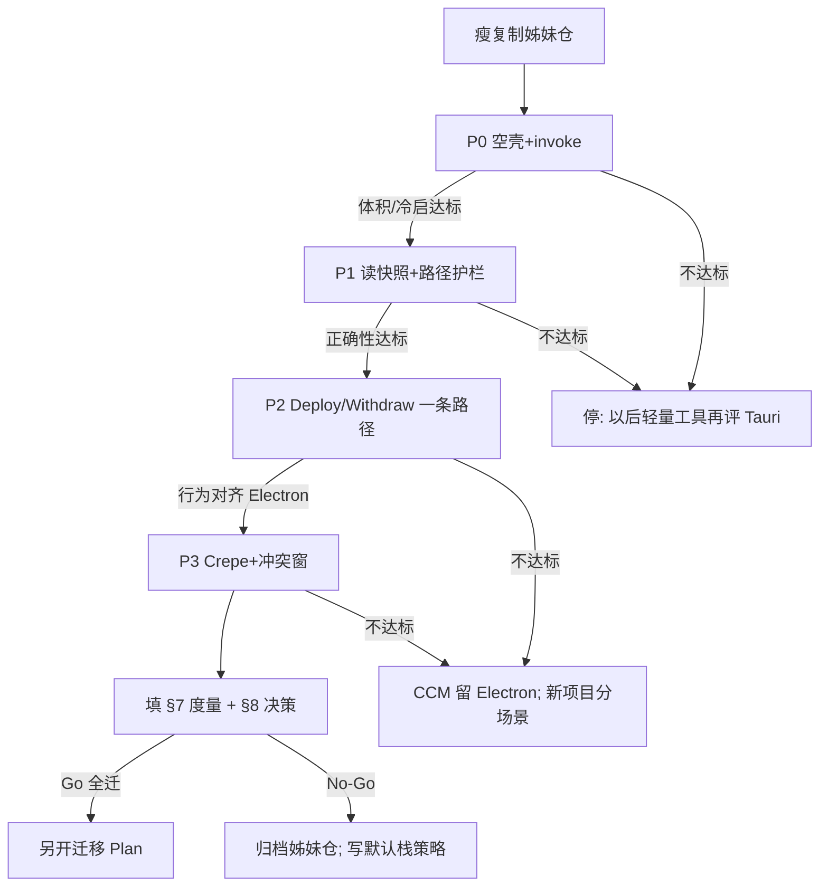

# 01 · Tauri 2 重构闸门（本仓正式执行计划）

> **日期**：2026-07-29  
> **性质**：本仓正式重构执行计划；P0–P4 **已完成**；**不是** CCM 全量迁移令  
> **来源**：自归档 `Archive/legacy-ccm-electron-2026-07-29/Plan/05-…` 提炼迁入  
> **P4 摘要（闸门当时）**：曾书面 CCM **不迁**；**已被** [02-CCM全量迁Tauri-2026-07-29](./02-CCM全量迁Tauri-2026-07-29.md) **推翻**（本仓改迁移仓，sidecar 过渡）。  
> **对比 UI（闸门后）**：默认挂全量 `App.tsx`；迁移后业务经 Node sidecar，不再大面积「未实现」。

---

## 1. 先给结论

| 问题 | 答案 | 级别 |
|------|------|------|
| 另开姊妹仓做对比，是否合理？ | **合理**。生产 Electron 仓不动，降低回归风险。 | **已验证**（本仓已跑通） |
| 「完全复制再全面重构」是否合理？ | **不合理作第一步**。须瘦复制 + 闸门。 | **已验证**（按闸门执行） |
| 对比目的是 CCM 一仓还是以后行为？ | **两者都要**；结果见 §8。 | **已验证**（P4 落盘） |
| 今日是否应弃 Electron / 迁 CCM？ | **否**。CCM **不迁**；新轻量工具优先 Tauri 2。 | **已验证策略**（P4） |
| 公平对比要看什么 UI？ | **全量 App 三栏**，不是 P0 Ping 闸门壳；P0 壳仅 `VITE_CCM_P0_SHELL=1` | **已验证**（入口已切） |

---

## 2. 你的计划：哪里对、哪里要改

### 2.1 对的部分

- **物理隔离**：不在 `CursorConfigManager` 主线上直接拆 Electron，避免半成品毁自用工具。  
- **用真实产品当样本**：比空 Hello World 更接近「以后做同类桌面工具」的成本。  
- **目标是对比而非冲动换壳**：与「完整对比影响以后行为」一致。

### 2.2 必须改掉的部分

| 原设想 | 问题 | 改成 |
|--------|------|------|
| 「完全复制」含 `node_modules`、`release`、`.vite` 等 | 体积巨大、无意义、易混路径 | **瘦复制**或 `git clone` / `robocopy` 排除清单（§4） |
| 复制后立刻全量把 `services/*` 迁 Rust | 无早期失败信号；数周后才知 Crepe/体积/权限翻车 | **P0→P3 闸门**；任一门失败可停，不必 sunk cost |
| 两仓默认同一 `%APPDATA%\CursorConfigManager` + 同一永久库 | 双开会抢 `settings.json` / `catalog.json`，对比数据污染 | **改 app 名与 settings 目录**；对比期用**独立库根**（§5） |
| 以「能跑起来」当成功 | 对「以后默认栈」证据不足 | 成功 = **度量表填满 + 书面决策**（§7、§8） |
| 姊妹仓无限期与主仓双轨 | 维护税；Docs/规则漂移 | 设 **决策日**（建议对比窗 2–4 周）；之后保留归档或合并一条主线 |

### 2.3 一句话修正版计划

> 建立 **瘦身姊妹仓** `CursorConfigManagerTauri2` → 只保留前端与契约 → 用 Tauri 2 重做壳与**最小**后端 → **分闸门**扩到 Deploy/冲突/Crepe → **填完整度量与决策表** → 决定 CCM 是否迁、以及**以后新项目默认壳**。

---

## 3. 完整对比要回答的问题（范围）

本对比 **不是**「哪个框架星星多」，而是你以后行为的三层决策：

| 层 | 问题 | 产出 |
|----|------|------|
| **A. 样本层（CCM）** | 把现有 CCM 迁到 Tauri，性价比是否成立？ | Go / No-Go / 仅新功能用 Tauri |
| **B. 品类层** | 「本地文件型桌面工具 + Web UI」默认选谁？ | 个人默认策略（§8） |
| **C. 例外层** | 何种项目仍选 Electron / 纯 WebView2 / 原生？ | 例外清单 |

**必须覆盖的对比轴**（每轴有数或有结论，禁止只凭感觉）：

1. **交付体积**（installer / unpacked）  
2. **冷启动与空闲内存**（同机、同库规模）  
3. **主路径正确性**（Deploy / Withdraw / 冲突 / 扫描）  
4. **编辑器可用性**（Crepe 打开、保存、快捷键）  
5. **工程成本**（人日：到 P2 / 到功能对等）  
6. **安全模型**（capabilities vs 现有 sandbox+IPC 白名单）  
7. **工具链摩擦**（Rust 安装、CI、AI 改码速度、与 hymd 同栈收益）  
8. **跨平台**（若你声称要跨平台：至少 Win 实测；mac 可标「本期不做」）

与 019 的关系：019 = **纸面结论**；本 Plan = **实证协议**。实证可推翻 019。

---

## 4. 姊妹仓建立（替换「完全复制」）

### 4.1 推荐路径（三选一，优先级从上到下）

| 方式 | 做法 | 适用 |
|------|------|------|
| **A. git clone / 新 remote 本地复制** | 新目录 clone 同一 remote，新分支 `tauri2-spike`；或 `git clone --local` | 有 git、要历史时可查 |
| **B. robocopy 瘦复制** | 见下方排除表 | 无干净 clone 时 |
| **C. 仅脚手架** | `npm create tauri-app` + 手工拷 `src/`、`shared/` | 最干净，但丢脚本/Docs 对照成本 |

**不推荐**：资源管理器整夹复制（必带 `node_modules`/`release`）。

### 4.2 瘦复制排除清单（硬）

复制 **不要** 带：

- `node_modules/`
- `release/`、`dist/`、`dist-electron/`
- `.vite/`、覆盖率/缓存目录
- 本机密钥、`.env`（若有）

复制 **要** 带（最少）：

- `src/`、`shared/`、`electron/`（作 Rust 移植参照，不是继续跑 Electron）
- `package.json` / lock（随后大改）
- `Docs/`（本仓已清盘：旧稿整包 Archive；活跃仅 L0 01~05 + 本 Plan）

### 4.3 建立后立即改名（硬）

| 项 | Electron 主仓 | Tauri 姊妹仓（必须不同） |
|----|---------------|--------------------------|
| 文件夹 | `CursorConfigManager` | `CursorConfigManagerTauri2`（**已验证**） |
| 产品名 / `productName` | CursorConfigManager | **CCM-Tauri2**（**已验证** `tauri.conf.json` / npm） |
| settings 目录 | `%APPDATA%\CursorConfigManager` | **`%APPDATA%\CCM-Tauri2`**（读写 **已验证** P1） |
| 默认永久库 | 例如 `C:\CursorSkills` | **`C:\CursorSkills-Tauri2Spike`**（常量已定） |
| 窗口标题 | 可辨认 | **含 `Tauri2`**（**已验证**） |
| identifier | — | **`local.ccm.tauri2`**（**已验证**） |

未改名就双开 = **对比无效**（数据互相覆盖）。

### 4.4 环境前置（待你本机确认）

- [x] Rust stable + `rustup`（**已验证** rustc/cargo 1.97.1）
- [x] Tauri 2 CLI（**已验证** `@tauri-apps/cli` 2.11.x）
- [x] WebView2 Runtime（**已验证** tauri info）
- [x] Node LTS（**已验证** Node 20.18.2；非 22 亦可编前端）
- [x] VS C++ 构建工具（**已验证** VS Community 2022）

---

## 5. 分阶段闸门（执行 checklist）

每阶段结束：**填度量 → Go/Kill**。Kill 不丢人，目的就是省全量重写。

### P0 · 空壳可运行（目标：1–3 天量级，推断）

- [x] 姊妹仓 `tauri:dev` / 发行 exe 起窗，加载**最小** React 页（`p0-main` / `p0-shell`）
- [x] 一条 `invoke('ping')` → Rust 回字符串（命令+ACL **已验证**编译；UI 点击 **待验证**）
- [x] `tauri build --no-bundle` 产出 Windows exe；记录体积（NSIS 因下载超时跳过）
- [x] 记录冷启：发行态启动约 5 s 进程仍存活（**已验证**冒烟；非秒表中位）

**P0 结论（2026-07-29）**：**Go**（体积轴）。exe ≈ **3.89 MB** ≪ 150 MB Kill 线，亦 ≪ Electron unpacked ~403 MB。

**Kill 条件**：工具链装不通、或 build 包体积相对 Electron **无明显优势**（例如仍 >150 MB unpacked 且无解释）且你本就为体积而来。

### P1 · 只读快照（目标：数天，推断）

- [x] Rust 实现「读独立库根 → 返回与 `getSnapshot` **字段兼容**的 JSON」（子集；`ensure_default_library` / `get_snapshot`）
- [x] 路径护栏思想保留（`resolve_library_safe_path`；拒 `..`/绝对；**已验证**单测）
- [x] 前端列表能显示条目（`p0-shell` 简化表；UI 点击 **待验证**，契约与库测 **已验证**）

**P1 结论（2026-07-29）**：**Go**。真实 AppData + spike 夹具 2 条 entry → `get_snapshot` 返回 2 项（**已验证**）；未触发 Kill。

**Kill 条件**：JSON 契约对不齐导致前端大面积改写成本爆炸；或文件枚举性能相对 Electron 差一个数量级且无优化路径。

### P2 · 一条写路径（目标：约 1 周量级，推断）

- [x] Deploy **或** Withdraw **一条**主路径与 Electron 行为对照（同库 fixture）→ **选定 Withdraw**
- [x] 哈希同删 / 异内容进冲突（至少一种）在 Tauri 侧可演示（**已验证**单测）
- [x] capabilities：写盘限制在配置库根 + `ActiveContainerRoot` / 用户全局（Rust 护栏；ACL `allow-withdraw`）

**P2 结论（2026-07-29）**：**Go**（Withdraw）。隔离容器 `{库根}\.spike-container`；未触真实 `~/.cursor` 默认验收。未触发 Kill。

**Kill 条件**：正确性对不齐且修复成本 >「继续 Electron 做产品」；或 capabilities 与批量路径操作严重打架。

### P3 · 编辑器与完整壳（仅 P2 Go 后）

- [x] 详情 Crepe（或当前编辑器）在 WebView2 下：打开、编辑、保存、最小写回（**最小挂载**；Rust I/O **已验证**；UI 点击 **待验证**）
- [x] 无边框/托盘/便携若需要，单独立项，**不阻塞**栈决策 → **本期不做**
- [x] 与 Electron 主仓做 **同机 A/B**：体积、内存、冷启、主路径 → 轻量填 §7（粗测）

**P3 结论（2026-07-29）**：**Go**（最小 Crepe）。exe ≈5.68 MB；dist ≈3.86 MB；WorkingSet ≈71 MB。闸门期**未**挂全量 App。未触发 Kill。

**对比 UI 对齐（闸门后 · 2026-07-29）**：为与 Electron 原版公平对比，默认入口改为挂全量 `App.tsx` + `src/tauri/ccmBridge.ts`（`window.ccm.invoke` → 已有 Rust 命令；未移植 method 明确报错）。**不推翻** P4「CCM 不迁」——这是对照仓外观/主路径对齐实验，不是全量迁 services。挂全量后 **§7 体积/内存须重测**（下表 P3 数字仍为闸门最小壳口径）。

**Kill 条件**：Crepe/快捷键/IME 在 WebView2 上不可接受缺陷且无替代编辑器方案。无边框/Crepe 致命不可用 → 改系统标题栏或退回 Electron 对比。为「全绿全功能」拖成全量迁 services → **停**，只保 UI 壳 + 已映射命令。

### P4 · 决策与策略落盘（必做，即使 Kill）

- [x] 填满 §7 表  
- [x] 写 §8 个人默认栈策略（落点：**本 Plan**；未另写主仓 Research/020）  
- [x] 姊妹仓：归档说明 / 删除 / 或转正式迁移仓（三选一写明）→ **保留对照/学习仓**（不删、不转正式迁移）

**P4 结论（2026-07-29）**：**对比窗关闭（书面决策完成）**。CCM **不迁** Electron 主仓；本仓 **保留**作 Tauri 对照；新项目「本地文件 + Web UI + 要小包」**优先试 Tauri 2**。禁止与主仓长期双轨产品；若日后要迁 CCM，须**另开迁移 Plan**。

---

## 6. 工作方法（降低双轨成本）

| 规则 | 说明 |
|------|------|
| **主仓继续产品** | skills.sh、安全闸等仍可在 Electron 推进；不因 spike 停摆 |
| **契约单向参照** | `shared/ipc.ts` / types 以主仓为 SSOT；姊妹仓只适配，不反向改主仓契约除非两边同意 |
| **禁止过早删 Electron 代码** | 姊妹仓可删 `electron/` 运行路径，但保留作移植对照直至 P2 过 |
| **禁止 Node sidecar 当「假 Tauri」** | 对比期若用 sidecar，体积数字必须标注「含 Node」，不得当纯 Tauri 胜出 |
| **记录人日** | 每阶段实际小时；否则无法回答「以后行为」里的成本轴 |

---

## 7. 度量登记表（实证用）

> P0–P3 已填关键格（2026-07-29）。未测项标 **待验证** / **未做** / **推断**。  
> **注意**：挂全量 `App.tsx` 后体积/内存/冷启 **须重测**；下表仍为 P3 最小壳实测，**不得**当作全量 UI 发行态数字。

| 指标 | Electron 主仓 | Tauri 姊妹仓 | 备注 |
|------|---------------|--------------|------|
| unpacked / 安装包 MB | ~403 / portable~95（019 已测） | **exe ≈ 5.68 MB**（P3 最小壳；无 NSIS；**已验证**） | P0 曾 ≈3.89；前端 dist≈3.86 MB（Crepe lazy ≈1.4 MB）；≪ 80 MB / 25% 阈值 → **体积轴 Go**；**全量 App 后待重测** |
| 空闲内存 MB | 未在本对比窗重测（**无法测·本期**） | ≈ **71** WorkingSet（粗测·启动 4 s；**已验证**·最小壳） | 未强制加载 Crepe chunk；**全量 App 后待重测** |
| 冷启到可点秒数 | 未在本对比窗重测（**无法测·本期**） | 冒烟：约 5 s 内进程存活（**已验证**）；≥3 次秒表中位 **待验证** | 发行态；**全量 App 后待重测** |
| P0 人日 | 0（已有） | ~0.5～1（**推断**） | 含装 Rust / ACL / NSIS 跳过 |
| P1 人日 | — | ~0.3～0.5（**推断**） | settings + catalog 只读 + 列表壳 |
| P2 人日 | — | ~0.5（**推断**） | Withdraw 双份态 + 单测夹具 |
| P3 人日 | — | ~0.5（**推断**） | library I/O + lazy Crepe；闸门期未接全量 App |
| 功能对等人日估 | — | **> 6 人周**（**推断**） | Deploy/冲突窗/扫描/全量 UI 未做；支撑 CCM 不迁 |
| Crepe 可用 | 已验证·本仓 Electron | **最小挂载已通**（Rust 读写 **已验证**；WebView2 IME/快捷键手测 **待验证**） | 现默认全量 App 内复用同一 Crepe |
| 双开数据隔离 | 同 APPDATA 会冲突 | **`CCM-Tauri2` 读写已验证** | settings + spike catalog（P1） |
| 主观：AI 改后端效率 | TS 高（约 4～5） | Rust 约 **3**（**建议**自评） | 闸门级可交付；全量 services 重写摩擦明显高于 TS |

**闸门总评（已验证 + 推断）**：

| 轴 | 结论 | 级别 |
|----|------|------|
| 体积 | Go（exe/dist 远低于 Electron unpacked） | **已验证** |
| 正确性（子集） | P2 Withdraw 双份态单测绿；全量 Deploy/冲突/扫描 **未做** | 子集 **已验证**；全量 **未验证** |
| 编辑器 | 最小 Crepe 挂载 + 库侧读写通；IME 手测未闭环 | 部分 **已验证** |
| 成本 | 闸门人日低；全量对等 **推断 >6 人周** → CCM **不迁** | **推断** |

**判定阈值（未改球门）**：体积阈值已满足；正确性「P2 fixture 全绿才谈迁」仅覆盖 Withdraw 子集，**不足以**支撑 CCM 全量迁移。

---

## 8. 以后软件开发的默认策略（**已验证策略** · 2026-07-29）

基于本仓 P0–P3 实证，将对比前草稿升格为**已验证策略**（可被日后迁移 Plan 推翻，不得默许双轨产品）：

| 项目类型 | 默认壳 | 理由 |
|----------|--------|------|
| 已有 Electron 产品（CCM、hymd 系） | **留 Electron** | 沉没成本 + 同栈；本 spike **未**证明全量对等值得迁 |
| 新项目：本地文件工具 + Web UI + 要小安装包 | **优先试 Tauri 2** | 体积轴 **已验证** 优势；隔离与最小读写路径可复用本仓样本 |
| 新项目：强依赖 Node 生态 / 快速 AI 出活 / 编辑器极重 | **Electron** | 后端零重写、Chromium 一致 |
| 仅 Windows + 愿写 C# 宿主 | WebView2 宿主（见归档 002） | 与 Tauri Win 同族渲染，无 Rust 门槛 |
| CLI/TUI 为主 | 非桌面壳 | 不套 Tauri |

**三点答复**：

1. **CCM**：不迁；继续 Electron 主仓产品。禁止本仓与主仓长期双轨发行。  
2. **新项目模板**：`tauri2-template` **暂缓**（先复用本仓目录/文档作样本即可）。  
3. **学习投资**：Rust **按需补**（做 Tauri 新项目时再加深），不为迁 CCM 而系统补课。

**姊妹仓去向**：**保留**为对照/学习仓（不删、不 zip 冷冻删除、不转「正式迁移仓」）。产品真相仍在 `E:\Code\CursorConfigManager`。

---

## 9. 风险与对策

| 风险 | 影响 | 对策 |
|------|------|------|
| 双开抢配置/库 | 对比数据作废、主库损坏 | §4.3 强制改名 + 独立库根 |
| 一次迁完全部 services | 烧时间无结论 | 闸门 Kill |
| 用 dev 态比冷启 | 数字骗人 | 发行态；对齐 015 |
| 姊妹仓 Docs/规则分叉 | 以后不知以谁为准 | 决策进**主仓** Research/Plan；姊妹仓少写文档 |
| 证明了 Tauri 更好就停更 Electron 产品 | 自用工具停滞 | 主仓产品与 spike **并行**；迁仓另开 Plan |
| 把竞品用 Tauri 当必须跟风 | 选错优化点 | 018：差异化不在壳 |

---

## 10. 验收：怎样算「完整对比做完」

同时满足：

1. §7 表 Electron/Tauri 关键格已填（或标「无法测」+原因）  
2. P0 必做；P2 有明确 Go 或 Kill 记录  
3. §8 策略表已按结果改定，并写入主仓可检索位置（更新本 Plan 状态行，或新 Research `020-桌面壳默认策略-…`）  
4. 姊妹仓去向已声明（删 / 归档 zip / 转迁移）  
5. **未**在无 P2 的情况下删除或停更主仓 Electron 发行

---

## 11. 近期行动顺序（你可照着勾）

1. [x] 认可本 Plan 对「完全复制」的修正（瘦复制 + 隔离 + 闸门）  
2. [x] 建 `E:\Code\CursorConfigManagerTauri2`（§4；整仓复制已发生）  
2b. [x] Docs 清盘：旧稿整包 Archive + L0 重建（2026-07-29）  
2c. [x] 瘦复制清理：已删 release/dist/dist-electron*/仓库根 Archive(legacy-wpf)/.vs/bin/*.bak（2026-07-29）  
3. [x] 改产品名 / identifier / 独立库根**常量**（AppData 读写 **已验证** P1）  
4. [x] 跑通 P0，填体积与冷启冒烟（**Go**；exe ≈3.89 MB）  
5. [x] P0 Go → **P1 Go** → **P2 Go** → **P3 Go**（最小 Crepe）  
6. [x] P4：§7/§8 默认栈策略落盘；**不开** CCM 全量迁移 Plan（除非日后另议）  
7. [x] 姊妹仓去向：**保留对照**（不删）

---

## 12. 对你原计划的最终评语

| | |
|--|--|
| **合理核** | 另开目录做重构对比，保护主仓，用真项目校准「以后默认栈」 |
| **不合理皮** | 整仓原样复制、无隔离、无闸门、以全量重构代替度量 |
| **推荐执行** | 按本 01 的修正版推进；**先 P0 数字，再谈爱恨** |
| **对比结果** | 体积轴胜出；CCM **不迁**；新轻量桌面工具 **优先 Tauri 2**（§8） |

---

**版本**：v1.6 | **更新**：2026-07-29 | **状态**：P0–P4 **完成**；CCM 不迁；本仓保留对照；默认 UI=全量 App（对比对齐）
